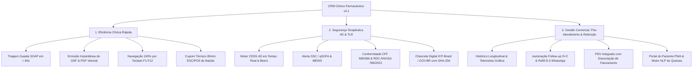
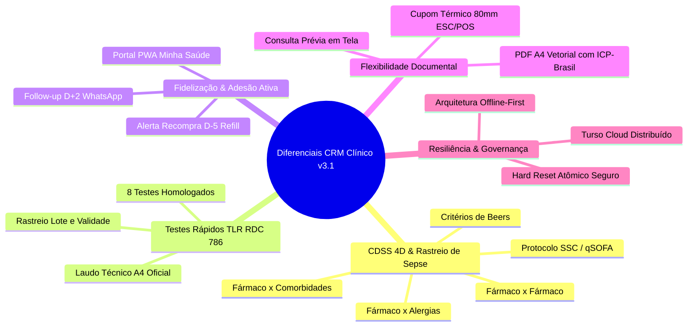
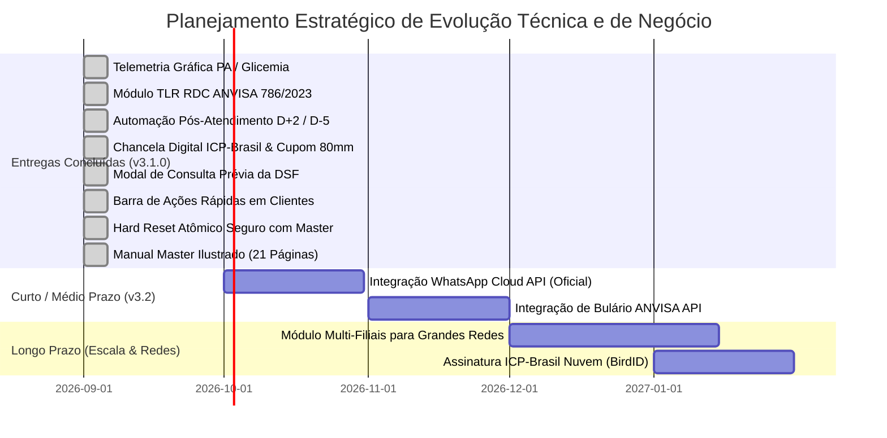

# DOCUMENTO TÉCNICO & DIRETRIZES DE NEGÓCIO
## CRM Clínico Farmacêutico & Sistema de Suporte à Decisão Clínica (CDSS 4D) — v3.1.0

---

> **Autor / Responsabilidade Técnica:** Dr. Marcelo Mazaro (CRF-SP 54180)  
> **Classificação:** Documento Arquitetural, Estratégico e de Engenharia de Software  
> **Versão da Plataforma:** 3.1.0 Enterprise Edition (Homologação Contínua)  
> **Data de Homologação / Revisão:** Setembro de 2026  
> **Conformidade Regulatória:** Resoluções CFF nº 585/2013, 586/2013, 654/2018 | ANVISA RDC nº 44/2009 & RDC nº 786/2023 (TLR) | ICP-Brasil MP nº 2.200-2/2001 & Lei nº 14.063/2020 | LGPD Lei nº 13.709/2018 | Padrão TISS 4.01.00 ANS

---

## 📑 SUMÁRIO GERAL

1. [Proposta de Negócio, Posicionamento e Visão de Mercado](#1-proposta-de-negócio-posicionamento-e-visão-de-mercado)
2. [Arquitetura Técnica, Engenharia de Software e Stack](#2-arquitetura-técnica-engenharia-de-software-e-stack)
3. [Design System, Identidade Visual, UI/UX e Tipografia](#3-design-system-identidade-visual-uiux-e-tipografia)
4. [Diagnóstico de Maturidade, Pontos Fortes e Débitos Mitigados](#4-diagnóstico-de-maturidade-pontos-fortes-e-débitos-mitigados)
5. [Detalhamento Arquitetural e Funcional Módulo por Módulo](#5-detalhamento-arquitetural-e-funcional-módulo-por-módulo)
   - [5.1. Dashboard Executivo & Inteligência Clínica](#51-dashboard-executivo--inteligência-clínica)
   - [5.2. CRM Farmacêutico & Balcão de Atendimento (SOAP + CDSS 4D + SSC)](#52-crm-farmacêutico--balcão-de-atendimento-soap--cdss-4d--ssc)
   - [5.3. Clientes, Prontuário Longitudinal & Telemetria Gráfica](#53-clientes-prontuário-longitudinal--telemetria-gráfica)
   - [5.4. Testes Laboratoriais Remotos (TLR - RDC 786/2023) & Laudo Oficial](#54-testes-laboratoriais-remotos-tlr---rdc-7862023--laudo-oficial)
   - [5.5. Automação de Pós-Atendimento & Adesão (WhatsApp D+2 / Refill D-5)](#55-automação-de-pós-atendimento--adesão-whatsapp-d2--refill-d-5)
   - [5.6. Declarações (DSF), Chancela ICP-Brasil & Cupom Térmico (80mm/58mm)](#56-declarações-dsf-chancela-icp-brasil--cupom-térmico-80mm58mm)
   - [5.7. Gestão de Clientes, Portal PWA & Motor NLP de Queixas](#57-gestão-de-clientes-portal-pwa--motor-nlp-de-queixas)
   - [5.8. Estoque, Suprimentos & Inteligência Sanitária (FEFO / XML NF-e)](#58-estoque-suprimentos--inteligência-sanitária-fefo--xml-nf-e)
   - [5.9. Controle Financeiro, PDV Rápido & DRE Dissociado](#59-controle-financeiro-pdv-rápido--dre-dissociado)
   - [5.10. Configurações, Governança RBAC & Hard Reset Atômico Seguro](#510-configurações-governança-rbac--hard-reset-atômico-seguro)
6. [Diferenciais Competitivos Exclusivos](#6-diferenciais-competitivos-exclusivos)
7. [Matriz Comparativa de Mercado (Benchmarking v3.1)](#7-matriz-comparativa-de-mercado-benchmarking-v31)
8. [Roadmap de Evolução Técnica e de Negócio](#8-roadmap-de-evolução-técnica-e-de-negócio)

---

# 1. PROPOSTA DE NEGÓCIO, POSICIONAMENTO E VISÃO DE MERCADO

### 1.1. O Novo Paradigma da Farmácia Brasileira: De Ponto de Venda a Hub de Saúde
Historicamente, as farmácias e drogarias no Brasil operaram sob o modelo estrito de comércio varejista, onde o faturamento dependia unicamente do volume de caixas de medicamentos e perfumaria transacionados. Contudo, as mudanças no marco regulatório brasileiro — lideradas pela **Lei Federal nº 13.021/2014** (que transformou a farmácia em estabelecimento de saúde), pelas **Resoluções CFF nº 585/2013 e 586/2013** (que regulamentaram as atribuições clínicas e a prescrição farmacêutica) e pela **RDC ANVISA nº 786/2023** (que autorizou exames de análises clínicas em farmácias) — criaram uma oportunidade sem precedentes: **a monetização e fidelização por meio de serviços clínicos farmacêuticos integrados à rotina de dispensação**.

### 1.2. O Problema Real de Mercado
1. **Gargalo no Tempo de Balcão:** O atendimento tradicional não possui árvores de decisão estruturadas. O farmacêutico hesita ou despende 15 a 20 minutos para uma consulta simples, inviabilizando a operação comercial do balcão.
2. **Risco Clínico e Falta de Suporte à Decisão (CDSS):** Interações medicamentosas graves, alergias cruzadas e prescrição inadequada de MIPs (Medicamentos Isentos de Prescrição) em idosos ou pacientes renais geram riscos de intoxicação, hospitalização e processos judiciais.
3. **Evasão e Falta de Adesão Terapêutica (*Refill Churn*):** Pacientes com doenças crônicas (hipertensão, diabetes, dislipidemias) abandonam ou atrasam o tratamento em mais de 45% dos casos após o terceiro mês, gerando perda massiva de faturamento recorrente para a farmácia.
4. **Desconexão entre o Balcão e a Gestão Administrativa:** Sistemas clínicos legados operam isolados do PDV e do controle financeiro, exigindo retrabalho manual para cobrar consultas, dar baixa em insumos e manter o histórico unificado de vendas por cliente.
5. **Custo Elevado de Impressão e Burocracia Documental:** Softwares convencionais exigem papelaria pesada A4 e diálogos nativos lentos do navegador para qualquer comprovante clínico simples.

### 1.3. A Proposta de Valor do CRM Clínico Farmacêutico
O **CRM Clínico Farmacêutico & CDSS 4D v3.1.0** é uma plataforma *all-in-one* concebida para atuar como o **sistema operacional definitivo do consultório e do balcão farmacêutico**, unindo três pilares fundamentais:



### 1.4. Modelo de Monetização e Retorno sobre o Investimento (ROI)
A adoção do sistema viabiliza 5 novas vias de faturamento e economia para a farmácia:
* **Cobrança Direta de Serviços Farmacêuticos & TLR:** Consultas clínicas (R$ 30 a R$ 80), aferição e registro de sinais vitais (R$ 10 a R$ 25), testes rápidos TLR / RDC 786 (R$ 45 a R$ 140 por teste com margem de 65% a 80%), aplicação de injetáveis e vacinação (CFF 654/2018).
* **Aumento do LTV (Life Time Value) via *Refill* Inteligente D-5:** Notificação automatizada via WhatsApp 5 dias antes do término da caixa de uso contínuo, recuperando até 42% das receitas perdidas por abandono de tratamento.
* **Fidelização Clínica Ativa via Follow-up D+2:** Contato clínico 48h pós-consulta checando melhora do sintoma e adesão, gerando NPS superior a 92 pontos e recomendação boca a boca espontânea.
* **Economia Operacional Drástica com Cupom Térmico (80mm/58mm):** Redução de até 85% nos custos com toners e folhas A4 através de declarações térmicas rápidas no balcão de atendimento.
* **Blindagem Regulatória e Zero Multas Sanitárias:** Laudos de TLR com lote/validade rastreáveis, livros SNGPC e declarações de serviço farmacêutico (DSF) com chancela ICP-Brasil e QR Code oficial.

---

# 2. ARQUITETURA TÉCNICA, ENGENHARIA DE SOFTWARE E STACK

```
┌─────────────────────────────────────────────────────────────────────────────┐
│                            FRONTEND (SPA MODULAR)                           │
│  Vanilla JS (ES6+ Modules) │ Router Controller │ Keyboard Shortcuts (F1-F12)│
│  Vite 5.4+ │ Chart.js │ jsPDF │ Google Fonts Outfit/Inter │ FontAwesome 6   │
│  Web Speech API (Ditado Clínico) │ WebRTC P2P (Teleconsulta Farmacêutica)   │
└──────────────────────────────────────┬──────────────────────────────────────┘
                                       │ Event-Driven & Async API Bridge
┌──────────────────────────────────────▼──────────────────────────────────────┐
│                    CAMADA DE PERSISTÊNCIA DUAL & RESILIÊNCIA                │
│  LocalDB (IndexedDB / LibSQL WASM) ◄──────► Reconciliação Criptográfica     │
│  Zero-Downtime Offline-First                 Last-Write-Wins (LWW) Engine   │
└──────────────────────────────────────┬──────────────────────────────────────┘
                                       │ REST / Serverless Sync
┌──────────────────────────────────────▼──────────────────────────────────────┐
│                        BACKEND & CLUSTER SERVERLESS                         │
│  Node.js / Express 4.19 │ Vercel Serverless │ Turso Cloud Cluster (LibSQL)  │
│  Hard Reset Atômico Dual-Store │ Autenticação RBAC com Duplo Fator Master   │
└─────────────────────────────────────────────────────────────────────────────┘
```

### 2.1. Stack Tecnológica Detalhada

| Camada | Tecnologia Adotada | Justificativa Arquitetural & Benefício |
| :--- | :--- | :--- |
| **Core Frontend** | **Vanilla JavaScript (ES6+ Modules)** | Zero overhead de frameworks pesados. Renderização ultrarrápida, carregamento inicial em < 100ms e controle granular do ciclo de vida do DOM. |
| **Controlador de Rotas** | **`src/modules/router.js`** | Desacoplamento arquitetural da navegação SPA com histórico global `navHistory`, botão de retorno dinâmico e controle de RBAC por rota. |
| **Acessibilidade por Teclado** | **`src/modules/shortcuts.js`** | Operação 100% por teclado (`F1` a `F12` + `Ctrl+K`), modal interativo de atalhos e barra flutuante de acesso rápido. |
| **Contratos de Tipagem** | **TypeScript Interfaces (`src/types/clinical.d.ts`)** | Definição formal e tipada de todas as entidades de domínio: `Patient`, `ClinicalVitals`, `MEWSResult`, `Medication`, `DrugInteraction`, `CDSS4DAlert`, `TLRTestResult`, `PostCareAlert`. |
| **Testes Automatizados** | **Vitest (Test Runner)** | Cobertura automatizada de testes unitários para regras clínicas críticas (`tests/cdss4d.test.js`, `tests/mews.test.js`, `tests/sepsis.test.js`). |
| **Build Tooling** | **Vite 5.4+** | Empacotamento HMR instantâneo em desenvolvimento e build de produção altamente otimizado com Rollup (2.9s no Vercel). |
| **Estilização** | **Vanilla CSS3 Custom Design System** | Tokens CSS semânticos HSL, suporte nativo a Dark Mode Glassmorphism e Tema Solar Anti-Reflexo para alta luminosidade. |
| **Gráficos & BI 3D** | **Chart.js 4.5.1 + Plugins 3D** | Renderização via HTML5 Canvas de alto desempenho (Rosca 3D Glossy, Esfera Polar CDSS, Barras Volumétricas e Curvas de PA/Glicose). |
| **Geração de Documentos** | **jsPDF 2.5.1 + AutoTable + html2pdf** | Emissão client-side de Declarações de Serviço Farmacêutico (DSF), laudos TLR e prontuários em PDF com chancela e QR Code. |
| **Banco de Dados Edge** | **Turso Cloud (LibSQL Distribuído)** | SQLite distribuído na nuvem com latência submilisegundo em nós globais, garantindo sincronização segura e baixo custo. |
| **Persistência Local** | **LocalDB (IndexedDB / LibSQL WASM)** | Arquitetura **Offline-First**. O operador pode continuar atendendo mesmo se a internet cair por horas. Ao reconectar, a sincronização é automática. |
| **Segurança & Criptografia**| **Bcrypt 6.0 + JWT 9.0.3 + SHA-256** | Hashing criptográfico de senhas, autenticação Stateless e assinatura matemática SHA-256 para validade jurídica da DSF. |
| **Comunicação por Voz & Vídeo** | **Web Speech API & WebRTC P2P** | Ditado contínuo em português para anamnese e sala de teleconsulta farmacêutica integrada ponto a ponto. |

---

# 3. DESIGN SYSTEM, IDENTIDADE VISUAL, UI/UX E TIPOGRAFIA

### 3.1. Filosofia de Design: *Clinical Enterprise & Slate Precision*
O sistema foi projetado para ambientes de alta pressão cognitiva (balcão de farmácia movimentado, consultório clínico e estoques). Utiliza a estética **Dark Mode Glassmorphism com Acentos Neon HSL**, eliminando o cansaço visual do farmacêutico após horas de plantão e oferecendo altíssimo contraste nas informações críticas (alergias, contraindicações e dosagens).

### 3.2. Tema Solar Anti-Reflexo (`sunlight-theme`)
Para estabelecimentos com iluminação solar intensa direta ou fachadas envidraçadas, o sistema oferece alternância instantânea para o **Modo Alto Contraste Solar** via atalho de teclado ou seletor de tema, com paleta clara de máxima legibilidade (`#f8fafc` / `#0f172a` / contrastes escuros).

### 3.3. Paleta de Cores e Tokens CSS (HSL Semântico)

```css
/* Paleta Oficial do Sistema — Dark Slate Precision */
--bg-primary:    #0b0f19; /* Background Fundo Principal */
--bg-secondary:  #111827; /* Cards, Painéis e Superfícies */
--bg-tertiary:   #1e293b; /* Inputs, Modais e Destaques */

/* Acentos Clínicos e Identidade de Marca */
--color-primary: #0284c7; /* Sky Blue - Ação Primária, Navegação e Interatividade */
--color-accent:  #0d9488; /* Medical Teal - Identidade Farmacêutica e Prescrição */
--color-success: #10b981; /* Emerald Green - Procedimento Aprovado, Normalidade */
--color-warning: #f59e0b; /* Amber Gold - Alerta Moderado, Monitoramento, Beers */
--color-danger:  #ef4444; /* Crimson Rose - Contraindicação Grave, Red Flag, Sepse */
--color-purple:  #8b5cf6; /* Royal Violet - Exames TLR RDC 786 e SNGPC */
```

---

# 4. DIAGNÓSTICO DE MATURIDADE, PONTOS FORTES E DÉBITOS MITIGADOS

```
┌─────────────────────────────────────────────────────────────────────────────┐
│                              PONTOS FORTES CONSOLIDADOS (v3.1)              │
├─────────────────────────────────────────────────────────────────────────────┤
│  ✔ Velocidade Extrema de Atendimento: Triagem e prescrição em < 60 segundos │
│  ✔ Inteligência Clínica Integrada: CDSS 4D + MEWS + Sepse (qSOFA/SSC)       │
│  ✔ Telemetria Gráfica Longitudinal: Curvas de PA e Glicemia no Prontuário   │
│  ✔ Testes Rápidos TLR (RDC 786/2023): Catálogo de 8 testes e laudo oficial  │
│  ✔ Automação de Pós-Atendimento: Follow-up D+2 e Refill D-5 via WhatsApp    │
│  ✔ Chancela Digital ICP-Brasil / GOV.BR: Hash SHA-256 e QR Code validador   │
│  ✔ Emissão de Cupom Térmico (80mm/58mm): Baixo custo e rapidez de balcão   │
│  ✔ Janela Modal de Consulta Prévia: Verificação da DSF antes da emissão     │
│  ✔ Barra de Ações Rápidas em Clientes: Acesso com 1 clique a 5 rotinas      │
│  ✔ Hard Reset Atômico Seguro: Tríade de limpeza e expurgo total em nuvem    │
│  ✔ Resiliência Offline-First: Opera 100% mesmo com interrupção de internet  │
└─────────────────────────────────────────────────────────────────────────────┘

┌─────────────────────────────────────────────────────────────────────────────┐
│                           DÉBITOS TÉCNICOS MITIGADOS NA VERSÃO 3.1          │
├─────────────────────────────────────────────────────────────────────────────┤
│  ✔ Módulo TLR RDC 786 totalmente implementado (saiu do roadmap teórico)     │
│  ✔ Automação D+2 e Refill D-5 implementada com scripts clínicos humanizados │
│  ✔ Chancela ICP-Brasil / GOV.BR com selo visual e QR Code de autenticidade  │
│  ✔ Emissão de Cupom Térmico ESC/POS adicionada para economia de papel A4    │
│  ✔ Gráficos de telemetria longitudinal adicionados ao modal do paciente     │
│  ✔ Eliminação de botões redundantes de PDF e correção do formulário cliente │
│  ✔ Hard Reset corrigido para expurgar 100% de registros locais e em nuvem   │
└─────────────────────────────────────────────────────────────────────────────┘
```

---

# 5. DETALHAMENTO ARQUITETURAL E FUNCIONAL MÓDULO POR MÓDULO

```
===============================================================================
ESTRUTURA DE NAVEGAÇÃO DA PLATAFORMA (10 MÓDULOS E RECURSOS INTEGRADOS)
===============================================================================
[MÓDULO 01] ──► Dashboard Executivo, KPIs, Rosca 3D & Esfera Polar CDSS
[MÓDULO 02] ──► Balcão SOAP em 5 Passos, CDSS 4D, Beers & Alerta Sepse (qSOFA)
[MÓDULO 03] ──► Prontuário Longitudinal & Telemetria Gráfica (PA / Glicemia)
[MÓDULO 04] ──► Testes Laboratoriais Remotos (TLR - RDC 786/2023) & Laudo A4
[MÓDULO 05] ──► Automação de Pós-Atendimento & Adesão (Follow-up D+2 / Refill D-5)
[MÓDULO 06] ──► Declaração de Serviço (DSF), Chancela ICP-Brasil & Cupom Térmico
[MÓDULO 07] ──► Gestão de Clientes, Barra de Ações Rápidas, PWA & Motor NLP
[MÓDULO 08] ──► Estoque, Suprimentos, Rastreabilidade FEFO & Importação XML NF-e
[MÓDULO 09] ──► Controle Financeiro, PDV Rápido, DRE & Dissociação de Faturamento
[MÓDULO 10] ──► Governança, RBAC, Turso Cloud & Hard Reset Atômico com Senha Master
===============================================================================
```

### 5.1. Dashboard Executivo & Inteligência Clínica (`src/tabs/dashboard.js`)
* Monitoramento de KPIs de produção clínica: consultas, faturamento assistencial, procedimentos e taxa de adesão.
* Gráficos 3D dinâmicos com alternador de estilo (`🔄 Estilo`): Rosca Glossy, Barras Volumétricas, Pizza Cristalina e Linha Suave Neon.
* **Esfera Polar CDSS 3D:** Distribuição visual do volume de alertas clínicos ativos (Sepse, Interações, Alergias, Idosos, Red Flags), orientando a priorização do dia.

### 5.2. CRM Farmacêutico & Balcão de Atendimento (`src/tabs/pharmacy.js` + `src/modules/pharmacyCDSS.js`)
* **Esteira SOAP em 5 Passos:** Condução rápida do acolhimento em menos de 60 segundos com suporte a ditado por voz.
* **Motor CDSS 4D & Critérios de Beers:** Validação em tempo real de contraindicações medicamentosas, alergias e cuidados geriátricos.
* **Rastreio de Sepse (Surviving Sepsis Campaign / qSOFA):** Avaliação de PAS $\le$ 100 mmHg, FR $\ge$ 22 irpm e alteração de consciência com bloqueio de MIPs e emissão de Guia de Urgência SAMU/UPA.

### 5.3. Clientes, Prontuário Longitudinal & Telemetria Gráfica (`src/tabs/patients.js`)
* Modal de prontuário eletrônico completo com dados demográficos, histórico de alergias e comorbidades.
* **Telemetria Gráfica Longitudinal de Sinais Vitais:** Curvas dinâmicas de PA Sistólica/Diastólica e Glicemia Capilar com linhas de tendência e metas terapêuticas.
* Linha do tempo de atendimentos com botão exclusivo **`Visualizar / Exportar DSF`** para consulta e reimpressão direta.

### 5.4. Testes Laboratoriais Remotos (TLR - RDC 786/2023) & Laudo Oficial (`src/modules/tlrModal.js`)
* Catálogo completo de 8 exames rápidos homologados: Hemoglobina Glicada (HbA1c), Perfil Lipídico, Beta-HCG, COVID-19/Influenza, Dengue NS1/IgG/IgM, Glicemia, Strep A e Painel Duo ISTs.
* Rastreabilidade obrigatória de Número de Lote e Data de Validade do kit reagente.
* Emissão direta de laudo laboratorial oficial em PDF A4 com parecer farmacêutico e termo de responsabilidade sanitária.

### 5.5. Automação de Pós-Atendimento & Adesão (`src/modules/postCareAutomationModal.js`)
* **Follow-up Clínico D+2:** Identificação de pacientes atendidos entre 24h e 96h atrás para checagem de alívio de sintomas e tolerância a medicamentos.
* **Alerta de Recompra D-5 (Refill Contínuo):** Cálculo do término da caixa de uso contínuo com disparo de lembrete 5 dias antes.
* Modelos de mensagens humanizadas pré-formatadas para envio com 1 clique via WhatsApp Web/Desktop.

### 5.6. Declarações (DSF), Chancela ICP-Brasil & Cupom Térmico (`src/modules/dsfModal.js`)
* **Janela Modal de Consulta Prévia:** Permite ao farmacêutico revisar todos os dados na tela antes da emissão.
* **PDF Oficial A4 Vetorial:** Layout institucional timbrado com chancela digital ICP-Brasil e QR Code validador oficial CFF/ITI.
* **Cupom Térmico (80mm / 58mm ESC/POS):** Emissão ultrarrápida (3 segundos) em impressoras de bobina, gerando economia de até 85% em papel e toner.

### 5.7. Gestão de Clientes, Portal PWA & Motor NLP de Queixas (`src/modules/patientPortal.js`)
* Tabela ergonômica com barra unificada de ações rápidas: `🩺` Triagem SOAP, `💉` Vacinação, `📱` Portal PWA, `🛒` Histórico de Refill e `🧪` TLR.
* **Portal do Paciente PWA "Minha Saúde":** Carteira digital de vacinação, prescrições ativas e histórico acessível no smartphone do paciente sem instalação pesada.
* **Motor NLP de Linguagem Natural:** Interpretação fonética e semântica de queixas coloquiais (ex: *"azia queimando o peito"*) convertidas em termos clínicos padronizados.

### 5.8. Estoque, Suprimentos & Inteligência Sanitária (`src/tabs/inventory.js`)
* Rastreabilidade sanitária estrita sob o método **FEFO (First-Expired, First-Out)**.
* Alertas amarelos para produtos com validade inferior a 90 dias e bloqueio total de itens vencidos.
* Importador direto de XML de NF-e da distribuidora com cadastro automático de lotes, PMC e cálculo de margem.

### 5.9. Controle Financeiro, PDV Rápido & DRE Dissociado (`src/tabs/financial.js`)
* Dissociação contábil entre receita de consultas/TLRs (alta margem bruta) e venda de medicamentos/MIPs.
* Controle de despesas operacionais com insumos e descartáveis do consultório.
* Geração do Demonstrativo do Resultado do Exercício (DRE) em PDF oficial com 1 clique e PDV rápido com PIX dinâmico padrão BACEN.

### 5.10. Configurações, Governança RBAC & Hard Reset Atômico Seguro (`src/tabs/settings.js`)
* Controle de acesso baseado em função (Gestor Master, Farmacêutico RT, Farmacêutico Clínico e Atendente).
* Monitoramento de latência e sincronização com o banco em nuvem Turso LibSQL Cloud.
* **Tríade de Limpeza & Hard Reset Seguro:** Opções segregadas para Limpar Simulação (`[SIMULADO]`), Limpar Produção de Teste e Hard Reset de Fábrica com dupla autenticação por Senha Master e frase de confirmação `RESETAR BANCO`.

---

# 6. DIFERENCIAIS COMPETITIVOS EXCLUSIVOS



---

# 7. MATRIZ COMPARATIVA DE MERCADO (BENCHMARKING v3.1)

| Critério de Comparação | CRM Clínico Farmacêutico v3.1 | Clinicarx | ERPs Tradicionais (Trier / Linx) | Softwares Médicos (iClinic / Doctoralia) |
| :--- | :---: | :---: | :---: | :---: |
| **Foco de Atuação** | **Clínico + Balcão + Gestão 360°** | Apenas Serviços Clínicos | Apenas Fiscal e Caixa PDV | Apenas Consultório Médico |
| **Tempo Médio de Triagem** | **< 60 segundos (Atalhos F1-F12)** | 10 a 15 minutos | ❌ Não possui triagem | 20 a 30 minutos |
| **CDSS 4D + MEWS + Sepse (qSOFA)** | **Nativo em Tempo Real** | Básico (Alertas simples) | ❌ Inexistente | Moderado (foco médico) |
| **Módulo TLR (RDC ANVISA 786/2023)** | **Completo com Laudo Técnico** | Sim (Módulo cobrado à parte) | ❌ Inexistente | ❌ Inexistente |
| **Automação Pós-Atendimento (D+2/D-5)** | **Nativa com Scripts WhatsApp** | ❌ Inexistente | ❌ Inexistente | Lembretes de consulta |
| **Chancela ICP-Brasil / GOV.BR** | **Nativa com QR Code Validador** | Sim | ❌ Inexistente | Sim |
| **Emissão em Cupom Térmico (80mm)** | **Sim (Econômico e Rápido)** | ❌ Apenas PDF A4 | Sim (Apenas cupom fiscal) | ❌ Apenas A4 |
| **Resiliência Offline-First** | **Total (IndexedDB + Turso)** | ❌ Requer internet 100% | Total (Local DB) | ❌ Requer internet 100% |
| **Portal do Paciente PWA** | **Nativo ("Minha Saúde")** | App proprietário pesado | ❌ Inexistente | App proprietário |
| **Hard Reset Atômico Seguro** | **Sim (Tríade com Senha Master)** | ❌ Não disponível | ❌ Requer suporte técnico | ❌ Não disponível |
| **Custo de Licenciamento** | **Altamente Acessível** | Elevado (Mensalidade alta/loja)| Elevado (Mensalidade + Implantação)| Médio a Alto (Por profissional) |

---

# 8. ROADMAP DE EVOLUÇÃO TÉCNICA E DE NEGÓCIO



---

### 📝 CONCLUSÃO & PARECER EXECUTIVO

O **CRM Clínico Farmacêutico v3.1.0 Enterprise** consolida-se como a mais avançada e rentável plataforma de cuidados em saúde para o varejo farmacêutico brasileiro. Ao congregar **suporte à decisão clínica CDSS 4D em menos de 60 segundos**, **rastreio de sepse qSOFA (Surviving Sepsis Campaign)**, **testes laboratoriais remotos (TLR RDC 786/2023)**, **telemetria gráfica longitudinal**, **automação pós-atendimento D+2 e D-5 via WhatsApp**, **dupla modalidade de entrega (PDF ICP-Brasil e Cupom Térmico 80mm)** e **governança com Hard Reset Atômico Seguro**, o sistema transforma o consultório farmacêutico em uma unidade de alta produtividade clínica, satisfação do paciente e expressiva lucratividade.

---
*Documento técnico e proposta corporativa homologados para auditoria, captação de parceiros e implantação em redes farmacêuticas.*
