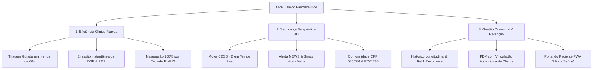
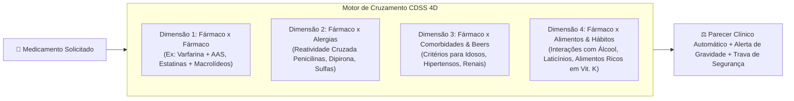
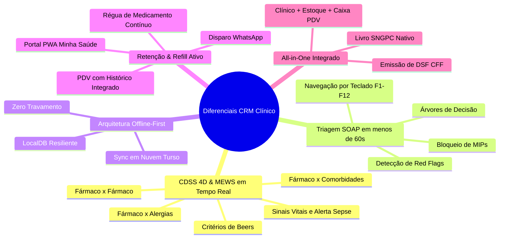
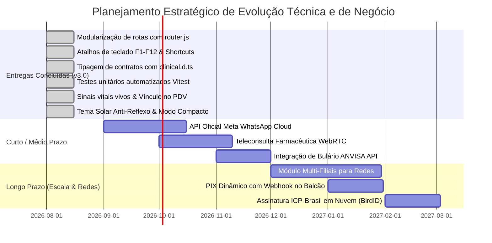

# DOCUMENTO TÉCNICO & DIRETRIZES DE NEGÓCIO
## CRM Clínico Farmacêutico & Sistema de Suporte à Decisão Clínica (CDSS 4D) — v3.0

---

> **Autor / Responsabilidade Técnica:** Dr. Marcelo Mazaro (CRF-SP 54180)  
> **Classificação:** Documento Arquitetural, Estratégico e de Engenharia de Software  
> **Versão do Sistema:** 3.0.0 Enterprise (Homologação Contínua)  
> **Data de Homologação / Revisão:** Agosto de 2026  
> **Conformidade Regulatória:** Resoluções CFF nº 585/2013, 586/2013, 654/2018 | ANVISA RDC nº 44/2009 & RDC nº 786/2023 | Padrão TISS 4.01.00 ANS

---

## 📑 SUMÁRIO GERAL

1. [Proposta de Negócio, Posicionamento e Visão de Mercado](#1-proposta-de-negócio-posicionamento-e-visão-de-mercado)
2. [Arquitetura Técnica, Engenharia de Software e Stack](#2-arquitetura-técnica-engenharia-de-software-e-stack)
3. [Design System, Identidade Visual, UI/UX e Tipografia](#3-design-system-identidade-visual-uiux-e-tipografia)
4. [Diagnóstico de Maturidade, Pontos Fortes e Débitos Mitigados](#4-diagnóstico-de-maturidade-pontos-fortes-e-débitos-mitigados)
5. [Detalhamento Arquitetural e Funcional Módulo por Módulo](#5-detalhamento-arquitetural-e-funcional-módulo-por-módulo)
   - [5.1. Dashboard & Métricas do Consultório](#51-dashboard--métricas-do-consultório)
   - [5.2. CRM Farmacêutico & Balcão de Atendimento (CDSS 4D + MEWS)](#52-crm-farmacêutico--balcão-de-atendimento-cdss-4d--mews)
   - [5.3. Clientes & Prontuário Longitudinal (Sinais Vitais & Refill Ativo)](#53-clientes--prontuário-longitudinal-sinais-vitais--refill-ativo)
   - [5.4. Declarações (DSF) & Relatórios Regulatórios](#54-declarações-dsf--relatórios-regulatórios)
   - [5.5. Estoque, Suprimentos & Inteligência de Compras](#55-estoque-suprimentos--inteligência-de-compras)
   - [5.6. Controle Financeiro, PDV Rápido & DRE](#56-controle-financeiro-pdv-rápido--dre)
   - [5.7. Configurações, Turso Cloud & Gestão de Operadores](#57-configurações-turso-cloud--gestão-de-operadores)
6. [Diferenciais Competitivos Exclusivos](#6-diferenciais-competitivos-exclusivos)
7. [Matriz Comparativa de Mercado (Benchmarking)](#7-matriz-comparativa-de-mercado-benchmarking)
8. [Roadmap de Evolução Técnica e de Negócio](#8-roadmap-de-evolução-técnica-e-de-negócio)

---

# 1. PROPOSTA DE NEGÓCIO, POSICIONAMENTO E VISÃO DE MERCADO

### 1.1. O Novo Paradigma da Farmácia Brasileira: De Ponto de Venda a Hub de Saúde
Historicamente, as farmácias e drogarias no Brasil operaram sob o modelo estrito de comércio varejista, onde o faturamento dependia unicamente do volume de caixas de medicamentos e perfumaria transacionados. Contudo, as mudanças no marco regulatório brasileiro — lideradas pela **Lei Federal nº 13.021/2014** (que transformou a farmácia em estabelecimento de saúde), pelas **Resoluções CFF nº 585/2013 e 586/2013** (que regulamentaram as atribuições clínicas e a prescrição farmacêutica) e pela **RDC ANVISA nº 786/2023** (que autorizou exames de análises clínicas em farmácias) — criaram uma oportunidade sem precedentes: **a monetização e fidelização por meio de serviços clínicos farmacêuticos integrados à rotina de dispensação**.

### 1.2. O Problema Real de Mercado
1. **Gargalo no Tempo de Balcão:** O atendimento tradicional não possui árvores de decisão estruturadas. O farmacêutico hesita ou despende 15 a 20 minutos para uma consulta simples, inviabilizando a operação comercial do balcão.
2. **Risco Clínico e Falta de Suporte à Decisão (CDSS):** Interações medicamentosas graves, alergias cruzadas e prescrição inadequada de MIPs (Medicamentos Isentos de Prescrição) em idosos ou pacientes renais geram riscos de intoxicação, hospitalização e processos judiciais.
3. **Evasão e Falta de Adesão Terapêutica (*Refill Churn*):** Pacientes com doenças crônicas (hipertensão, diabetes, dislipidemias) abandonam ou atrasam o tratamento em mais de 45% dos casos após o terceiro mês, gerando perda massiva de faturamento recorrente para a farmácia.
4. **Desconexão entre o Balcão e a Gestão Administrativa:** Sistemas clínicos legados operam isolados do PDV e do controle financeiro, exigindo retrabalho manual para cobrar consultas, dar baixa em insumos e manter o histórico unificado de vendas por cliente.

### 1.3. A Proposta de Valor do CRM Clínico Farmacêutico
O **CRM Clínico Farmacêutico & CDSS 4D** é uma plataforma *all-in-one* concebida para atuar como o **sistema operacional definitivo do consultório e do balcão farmacêutico**, unindo três pilares fundamentais:



### 1.4. Modelo de Monetização e Retorno sobre o Investimento (ROI)
A adoção do sistema viabiliza 4 novas vias de faturamento e economia para a farmácia:
* **Cobrança Direta de Serviços Farmacêuticos:** Consultas clínicas, aferição e registro de sinais vitais, aplicação de injetáveis, vacinação (CFF 654/2018), testes rápidos (TLR / RDC 786) e revisão da farmacoterapia.
* **Aumento do LTV (Life Time Value) via *Refill* Inteligente:** Notificação automatizada via WhatsApp nos dias que antecedem o término do medicamento contínuo, recuperando até 38% das receitas perdidas por esquecimento.
* **Elevação do Ticket Médio por Prescrição Complementar:** Sugestão algorítmica de terapias não-farmacológicas e MIPs seguros baseados na queixa triada.
* **Blindagem Regulatória e Zero Multas:** Geração de livros SNGPC, termos de consentimento e declarações de serviço farmacêutico (DSF) com chancela eletrônica e QR Code.

---

# 2. ARQUITETURA TÉCNICA, ENGENHARIA DE SOFTWARE E STACK

```
┌─────────────────────────────────────────────────────────────────────────────┐
│                            FRONTEND (SPA MODULAR)                           │
│  Vanilla JS (ES6+ Modules) │ Router Controller │ Keyboard Shortcuts (F1-F12)│
│  Vite 5.4+ │ Chart.js │ jsPDF │ Google Fonts Outfit/Inter │ FontAwesome 6   │
└──────────────────────────────────────┬──────────────────────────────────────┘
                                       │ Event-Driven & Async API Bridge
┌──────────────────────────────────────▼──────────────────────────────────────┐
│                    CAMADA DE PERSISTÊNCIA DUAL & RESILIÊNCIA                │
│  LocalDB (IndexedDB / LocalStorage) ◄──────► Reconciliação Criptográfica    │
│  Zero-Downtime Offline-First                 Last-Write-Wins (LWW) Engine   │
└──────────────────────────────────────┬──────────────────────────────────────┘
                                       │ REST / Serverless Sync
┌──────────────────────────────────────▼──────────────────────────────────────┐
│                        BACKEND & CLUSTER SERVERLESS                         │
│  Node.js / Express 4.19 │ Vercel Serverless │ Turso Cloud Cluster (LibSQL)  │
└─────────────────────────────────────────────────────────────────────────────┘
```

### 2.1. Stack Tecnológica Detalhada

| Camada | Tecnologia Adotada | Justificativa Arquitetural & Benefício |
| :--- | :--- | :--- |
| **Core Frontend** | **Vanilla JavaScript (ES6+ Modules)** | Zero overhead de frameworks pesados. Renderização ultrarrápida, carregamento em < 100ms e controle granular do ciclo de vida do DOM. |
| **Controlador de Rotas** | **`src/modules/router.js`** | Desacoplamento arquitetural da navegação SPA com histórico global `navHistory`, botão de retorno dinâmico e controle de RBAC por rota. |
| **Acessibilidade por Teclado** | **`src/modules/shortcuts.js`** | Operação 100% por teclado (`F1` a `F12`), modal interativo de atalhos e barra flutuante de acesso rápido. |
| **Contratos de Tipagem** | **TypeScript Interfaces (`src/types/clinical.d.ts`)** | Definição formal e tipada de todas as entidades de domínio: `Patient`, `ClinicalVitals`, `MEWSResult`, `Medication`, `DrugInteraction`, `CDSS4DAlert`, `ClinicalEncounter`, `FinancialInstallment`. |
| **Testes Automatizados** | **Vitest (Test Runner)** | Cobertura automatizada de testes unitários para regras clínicas críticas (`tests/cdss4d.test.js`, `tests/mews.test.js`). |
| **Build Tooling** | **Vite 5.4+** | Empacotamento HMR instantâneo em desenvolvimento e build de produção altamente otimizado com Rollup. |
| **Estilização** | **Vanilla CSS3 Custom Design System** | Tokens CSS semânticos HSL, suporte nativo a Dark Mode Glassmorphism e Tema Solar Anti-Reflexo para alta luminosidade. |
| **Gráficos & BI** | **Chart.js 4.5.1** | Renderização de gráficos via HTML5 Canvas de alto desempenho (linhas, barras, radar e rosca). |
| **Geração de Documentos** | **jsPDF 2.5.1 + AutoTable + html2pdf** | Emissão client-side de Declarações de Serviço Farmacêutico (DSF), laudos e prontuários em PDF com chancela e QR Code. |
| **Banco de Dados Edge** | **Turso Cloud (LibSQL Distribuído)** | SQLite distribuído na nuvem com latência submilisegundo em nós globais, garantindo sincronização segura e baixo custo. |
| **Persistência Local** | **LocalDB (IndexedDB / LocalStorage)** | Arquitetura **Offline-First**. O operador pode continuar atendendo mesmo se a conexão de internet cair por horas. Ao reconectar, a sincronização é automática. |
| **Segurança & Criptografia**| **Bcrypt 6.0 + JWT 9.0.3** | Hashing criptográfico de senhas e autenticação Stateless via Bearer Token. |
| **Interoperabilidade** | **Padrão TISS 4.01.00 / TUSS ANS** | Geração de XML no padrão oficial de saúde suplementar para faturamento de procedimentos e exames clínicos. |

### 2.2. O Motor de Decisão Clínica Multidimensional (CDSS 4D)
Implementado em `src/modules/pharmacyCDSS.js` e `src/modules/clinicalAI.js`, o motor opera em **4 dimensões algorítmicas simultâneas**:



### 2.3. Motores Auxiliares de Inteligência
* **Motor MEWS (Modified Early Warning Score) & Monitoramento de Vitais:** Algoritmo automatizado que calcula o escore fisiológico do paciente a partir da Pressão Arterial, Frequência Cardíaca, Frequência Respiratória, Temperatura, Saturação de Oxigênio (SpO2) e Nível de Consciência (Glasgow), classificando o risco em *Baixo*, *Moderado*, *Alto* ou *Crítico* (alerta de sepse/colapso).
* **Classificação Automática de Pressão Arterial:** Interpretação em tempo real da PA (Ótima, Normal, Pré-hipertensão, Hipertensão Estágio 1, 2, 3 ou Crise Hipertensiva) conforme as Diretrizes Brasileiras de Hipertensão Arterial (SBC/SBH).
* **Processamento de Linguagem Natural (PLN / Spotlight):** O módulo `src/modules/universalSearch.js` implementa um analisador semântico capaz de interpretar termos em linguagem natural digitados pelo usuário (ex: *"quero cadastrar cliente"*, *"ver estoque baixo"*, *"dar baixa no caixa"*) e executar a ação correspondente instantaneamente via atalho `Ctrl + K`.
* **Motor de Validação de Red Flags:** Árvores de decisão em `src/modules/smartFlowGuide.js` e `src/tabs/pharmacy.js` que identificam sintomas de alerta máximo (ex: rigidez de nuca, dor torácica irradiada, hemoptise, febre refratária) e bloqueiam a dispensação de MIPs, forçando a emissão de Guia de Encaminhamento Médico de Urgência.

---

# 3. DESIGN SYSTEM, IDENTIDADE VISUAL, UI/UX E TIPOGRAFIA

### 3.1. Filosofia de Design: *Clinical Enterprise & Slate Precision*
O sistema foi projetado para ambientes de alta pressão cognitiva (balcão de farmácia movimentado, consultório clínico e estoques). Utiliza a estética **Dark Mode Glassmorphism com Acentos Neon HSL**, eliminando o cansaço visual do farmacêutico após horas de plantão e oferecendo altíssimo contraste nas informações críticas (alergias, contraindicações e dosagens).

### 3.2. Tema Solar Anti-Reflexo (`sunlight-theme`)
Para estabelecimentos com iluminação solar intensa direta ou fachadas envidraçadas, o sistema oferece alternância instantânea para o **Modo Alto Contraste Solar** via tecla `F12` ou seletor de tema, com paleta clara de máxima legibilidade (`#f8fafc` / `#0f172a` / contrastes escuros).

### 3.3. Paleta de Cores e Tokens CSS (HSL Semântico)

```css
/* Paleta Oficial do Sistema — Dark Slate Precision */
--bg-primary:    #0b0f19; /* Background Fundo Principal */
--bg-secondary:  #111827; /* Cards, Painéis e Superfícies */
--bg-tertiary:   #1e293b; /* Inputs, Modais e Destaques */

/* Acentos Clínicos e Identidade de Marca */
--color-primary: #0284c7; /* Sky Blue - Ação Primária, Navegação e Interatividade */
--color-accent:  #0d9488; /* Medical Teal - Identidade Farmacêutica e Prescrição */
--color-success: #10b981; /* Emerald Green - Procedimento Aprovado, Normalidade */
--color-warning: #f59e0b; /* Amber Gold - Alerta Moderado, Monitoramento, Beers */
--color-danger:  #ef4444; /* Crimson Rose - Contraindicação Grave, Red Flag, Erro */
--color-purple:  #8b5cf6; /* Royal Violet - SNGPC, Psicotrópicos e Controle Especial */
```

### 3.4. Tipografia Corporativa

```
┌─────────────────────────────────────────────────────────────────────────────┐
│  FONTE HEADINGS & NÚMEROS KPI: "Outfit" (Google Fonts)                      │
│  Pesos: 600 (Semi-bold), 700 (Bold), 800 (Extra-bold)                       │
│  Aplicação: Títulos de abas, contadores de métricas, valores em Reais (R$)  │
├─────────────────────────────────────────────────────────────────────────────┤
│  FONTE CORPO & FORMULÁRIOS: "Inter" (Google Fonts)                          │
│  Pesos: 400 (Regular), 500 (Medium), 600 (Semi-bold)                       │
│  Aplicação: Prontuários, bulários, inputs, tabelas, notificações e alertas  │
├─────────────────────────────────────────────────────────────────────────────┤
│  FONTE MONOESPAÇADA: "JetBrains Mono" / System Monospace                    │
│  Aplicação: CPFs, Códigos de Barras EAN-13, Hashes CFF, XML TISS e JSON     │
└─────────────────────────────────────────────────────────────────────────────┘
```

### 3.5. Ergonomia, Densidade Visual & Navegação por Teclado
* **Navegação 100% por Teclado (`F1` a `F12`):**
  * `F1`: Ajuda e Guia Completo de Atalhos
  * `F2`: CRM Farmacêutico & Balcão de Atendimento
  * `F3`: Clientes & Prontuário Longitudinal
  * `F4`: Controle de Estoque & Suprimentos
  * `F6`: Controle Financeiro & Fluxo de Caixa
  * `F7`: Declarações (DSF) & Relatórios Regulatórios
  * `F8`: Dashboard & Indicadores do Consultório
  * `F9`: Configurações & Gestão de Operadores
  * `F10`: Caixa Rápido / Nova Venda PDV
  * `F11`: Alternar Modo Compacto Hospitalar
  * `F12`: Alternar Modo Solar Anti-Reflexo
* **Modo Compacto Hospitalar:** Alternância instantânea (`F11`) com persistência em `localStorage` para aumento de densidade de dados na tela em monitores de PDV.

---

# 4. DIAGNÓSTICO DE MATURIDADE, PONTOS FORTES E DÉBITOS MITIGADOS

```
┌─────────────────────────────────────────────────────────────────────────────┐
│                              PONTOS FORTES CONSOLIDADOS                     │
├─────────────────────────────────────────────────────────────────────────────┤
│  ✔ Velocidade Extrema de Atendimento: Triagem e prescrição em < 60 segundos │
│  ✔ Inteligência Clínica Integrada: CDSS 4D + MEWS ativos no momento do ato  │
│  ✔ Lançamento de Sinais Vitais Vivos: PA, FC, Temp, SpO2, Glicemia, IMC     │
│  ✔ PDV Integrado com Vinculação de Cliente: Histórico de compras instantâneo│
│  ✔ Navegação 100% por Teclado: Atalhos F1 a F12 + Barra de Acesso Rápido    │
│  ✔ Resiliência Offline-First: Nunca trava ou interrompe as operações        │
│  ✔ Arquitetura Modularizada: Router Controller desacoplado e Tipos d.ts     │
│  ✔ Testes Unitários Automatizados: Suíte Vitest cobrindo CDSS 4D e MEWS     │
│  ✔ Rigor Regulatório: DSF CFF 585/586, SNGPC Portaria 344/98 e RDC 786     │
└─────────────────────────────────────────────────────────────────────────────┘

┌─────────────────────────────────────────────────────────────────────────────┐
│                           DÉBITOS TÉCNICOS MITIGADOS                        │
├─────────────────────────────────────────────────────────────────────────────┤
│  ✔ Desacoplamento de rotas e navegação via src/modules/router.js             │
│  ✔ Contratos de dados formais via src/types/clinical.d.ts                   │
│  ✔ Implementação de testes unitários automatizados com Vitest               │
│  ✔ Integração direta entre o PDV de Venda Rápida e o Prontuário de Compras │
└─────────────────────────────────────────────────────────────────────────────┘

┌─────────────────────────────────────────────────────────────────────────────┐
│                          DÉBITOS RESIDUAIS & PRÓXIMOS PASSOS                │
├─────────────────────────────────────────────────────────────────────────────┤
│  ⚠ Bulário Farmacológico: Evoluir de base local curada para API externa     │
│  ⚠ Disparo de WhatsApp: Expandir de URI scheme para WhatsApp Cloud API      │
│  ⚠ Certificado Digital: Integrar assinatura em nuvem ICP-Brasil (BirdID)    │
└─────────────────────────────────────────────────────────────────────────────┘
```

---

# 5. DETALHAMENTO ARQUITETURAL E FUNCIONAL MÓDULO POR MÓDULO

```
===============================================================================
ESTRUTURA DE NAVEGAÇÃO DA PLATAFORMA (7 MÓDULOS INTEGRADOS)
===============================================================================
[F2 - BALCÃO]    ──► Triagem SOAP, CDSS 4D, Prescrição MIPs, Vacinas & SNGPC
[F3 - PACIENTES] ──► Prontuário Longitudinal, Sinais Vitais, Compras & Portal
[F4 - ESTOQUE]   ──► Catálogo, Curva ABC, Scanner EAN, NFe XML & Precificação
[F6 - FINANCEIRO]──► Fluxo de Caixa, DRE, PDV Nova Venda & Cupom Térmico
[F7 - RELATÓRIOS]──► Emissão de DSF CFF 585/586, Encaminhamento & Faturamento
[F8 - DASHBOARD] ──► Métricas em Tempo Real, Gráficos de Produção & Ocupação
[F9 - CONFIGS]   ──► RBAC, Turso Cloud, Dados da Farmácia, Backup & Protocolos
===============================================================================
```

---

### 5.1. Dashboard & Métricas do Consultório (`src/tabs/dashboard.js`)
* **Função Principal:** Painel de Inteligência Gerencial e Clínica em tempo real para o Farmacêutico Responsável Técnico e Gestores.
* **Componentes & Fluxo:**
  * 4 Cards Interativos de KPIs: Pacientes Atendidos Hoje, Taxa de Ocupação do Consultório, Tempo Médio de Espera e Faturamento Clínico Acumulado.
  * Gráfico de Volume de Atendimentos por Faixa Horária (Chart.js com gradiente azul/verde).
  * Gráfico de Queixas Clínicas Mais Recorrentes (Cefaleia, Sintomas Gripais, Dispepsia, Rinite, Hipertensão).
  * Lista de Pacientes em Observação Clínica no Consultório.
* **Pontos Fortes:**
  * Cards clicáveis que já filtram e redirecionam o operador para a ação correspondente.
  * Renderização instantânea utilizando dados agregados em memória cache com TTL de 30 segundos.

---

### 5.2. CRM Farmacêutico & Balcão de Atendimento (`src/tabs/pharmacy.js` + `src/modules/pharmacyCDSS.js` + `src/modules/clinicalAI.js`)
* **Função Principal:** O coração operacional do sistema. Triagem rápida de queixas, validação de segurança CDSS 4D, cálculo de escore MEWS, prescrição de MIPs, registro de vacinação e controle de medicamentos especiais.
* **Componentes & Fluxo:**
  1. *Seleção do Paciente e Anamnese Rápida (< 60s):* Seleção por nome ou CPF com carregamento automático de alergias e comorbidades prévias.
  2. *Árvore de Decisão por Queixa:* Protocolos prontos para Gripe/Resfriado, Azia/Refluxo, Dor/Febre, Alergias Cutâneas, Diarreia e Lombalgia.
  3. *Mapeamento de Red Flags:* Se o paciente relata febre > 39°C há mais de 4 dias ou sangue nas fezes, o sistema bloqueia os MIPs e emite a Guia de Encaminhamento Médico.
  4. *Prescrição Farmacêutica Segura:* Adição de MIPs com conferência em tempo real de dosagens, interações com a medicação crônica do paciente e alertas de Critérios de Beers para idosos.
  5. *Vacinação & Injetáveis (CFF 654/2018):* Registro de via de administração, lote, validade, músculo (deltóide D/E, vasto lateral) e emissão de carteirinha.
  6. *Livro SNGPC (Portaria 344/98):* Módulo para retenção de receita e controle de substâncias das listas A1, A2, B1, B2 e C1.
* **Pontos Fortes:**
  * Redução drástica do tempo de consulta mantendo conformidade sanitária absoluta.
  * Disparo da receita e orientações posológicas diretamente para o WhatsApp do paciente com 1 clique.

---

### 5.3. Clientes & Prontuário Longitudinal (`src/tabs/patients.js` + `src/modules/patientPurchasesModal.js` + `src/modules/patientPortal.js`)
* **Função Principal:** Gestão do ciclo de vida, histórico de saúde e relacionamento comercial de cada paciente.
* **Componentes & Fluxo:**
  * *Cadastro Completo do Paciente:* Dados demográficos, CPF, WhatsApp, plano de saúde, lista de comorbidades crônicas e histórico de alergias.
  * *Lançamento e Monitoramento de Sinais Vitais Vivos:*
    * Pressão Arterial (Sistólica/Diastólica) com classificação instantânea segundo diretrizes de hipertensão e badges visuais coloridos.
    * Frequência Cardíaca (bpm), Temperatura (°C), Frequência Respiratória (rpm), Saturação de O2 (SpO2) e Glicemia Capilar (mg/dL).
    * Peso (kg) e Altura (cm) com cálculo automático de IMC e faixa de classificação.
    * Inclusão estruturada de todos os sinais vitais na emissão de PDF do Prontuário do Paciente.
  * *Histórico de Compras & Vendas Integrado (`🛒`):* Visualização em tempo real de todas as vendas e itens adquiridos pelo paciente no PDV, com totalizadores e datas.
  * *Régua de Adesão e Cálculo de Refill Programado:* Algoritmo que calcula quando a medicação contínua vai acabar e gera alerta para contato proativo de recompra via WhatsApp.
  * *Portal do Paciente PWA "Minha Saúde" (`📱`):* Simulador de smartphone do paciente onde ele acessa sua carteirinha digital, receitas emitidas e despertador de horários de medicação.

---

### 5.4. Declarações (DSF) & Relatórios Regulatórios (`src/tabs/reports.js`)
* **Função Principal:** Central de emissão de documentos oficiais e relatórios analíticos em PDF e Excel.
* **Componentes & Fluxo:**
  * *Declaração de Serviço Farmacêutico (DSF):* Documento oficial exigido pelo CFF contendo identificação da farmácia, farmacêutico com CRF, dados do paciente, procedimento realizado, valores aferidos, orientações e hash criptográfico de autenticação.
  * *Encaminhamento Médico Formal:* Laudo estruturado para o médico assistente explicando os motivos do encaminhamento e os sinais de alarme detectados.
  * *Relatório de Procedimentos e Faturamento Clínico:* Extrato exportável em PDF e XLSX com totalização de consultas e procedimentos por período.

---

### 5.5. Estoque, Suprimentos & Inteligência de Compras (`src/tabs/inventory.js` + `src/modules/barcodeScanner.js` + `src/modules/nfeImporter.js`)
* **Função Principal:** Gestão de medicamentos, insumos clínicos, controle de perdas e cálculo de formação de preço.
* **Componentes & Fluxo:**
  * *Catálogo Geral com Curva ABC:* Categorização por volume de vendas e lucratividade.
  * *Scanner Óptico de Código de Barras (EAN-13):* Leitura em tempo real pela webcam ou câmera de smartphone com biblioteca Quagga/ZXing integrada e bip auditivo.
  * *Controle de Lotes e Validades Críticas:* Destaque automático em vermelho para lotes vencendo em menos de 90 dias.
  * *Importador de NF-e XML de Distribuidoras:* Leitura direta do arquivo XML da nota fiscal, cadastrando novos produtos e atualizando estoques e custos em lote.
  * *Calculadora de Precificação Farmacêutica:* Simulação de margem líquida, markup, PIS/COFINS e ICMS-ST para evitar venda com prejuízo.

---

### 5.6. Controle Financeiro, PDV Rápido & DRE (`src/tabs/financial.js` + `src/modules/cashRegister.js` + `src/modules/quickCheckoutModal.js`)
* **Função Principal:** Gestão financeira completa do consultório e do balcão de vendas.
* **Componentes & Fluxo:**
  * *Caixa Rápido / Nova Venda (`F10`):*
    * Vinculação visual imediata do paciente ativo selecionado no prontuário.
    * Campo pesquisável de clientes para troca rápida de comprador.
    * Persistência do registro de compra com atualização instantânea do histórico do paciente.
  * *Fechamento de Caixa Cego:* O operador informa o valor em dinheiro sem ver o saldo do sistema; o sistema calcula e aponta eventuais quebras ou sobras de caixa.
  * *Emissão de Cupom Térmico (58mm / 80mm):* Impressão direta de recibo não-fiscal para impressoras térmicas padrão ESC/POS.
  * *DRE Gerencial Executivo:* Demonstração do Resultado do Exercício com Receita Bruta, Custos Variáveis (CMV), Despesas Fixas e Lucro Líquido Real.
  * *Gestão Dinâmica de Parâmetros com Botões `+`:* Adição de novas categorias de receita/despesa e bandeiras de cartão no ato do lançamento.

---

### 5.7. Configurações, Turso Cloud & Gestão de Operadores (`src/tabs/settings.js` + `src/modules/auth.js`)
* **Função Principal:** Central de administração, segurança, sincronização e governança do sistema.
* **Componentes & Fluxo (Estruturado em 7 Agrupamentos):**
  1. *Gestão de Operadores & RBAC:* Controle de permissões para Gestor Master, Farmacêutico RT, Farmacêutico Clínico e Atendente.
  2. *Banco Turso Cloud (LibSQL Distribuído):* Monitoramento do cluster com indicação de latência e sincronização de backups.
  3. *Dados da Farmácia & RT:* Cadastro de CNPJ, Razão Social, Endereço e CRF do Responsável Técnico para documentos oficiais.
  4. *Backup & Restauração JSON:* Exportação e importação de segurança com criptografia local.
  5. *Protocolos Clínicos Interativos:* 6 protocolos clínicos editáveis com referências bibliográficas.
  6. *Simulador Sandbox & Gestão de Dados:* Gerador de dados de teste realistas e ferramenta de limpeza protegida por senha.
  7. *Parâmetros Financeiros CRUD:* Cadastro de centros de custo e formas de pagamento.

---

# 6. DIFERENCIAIS COMPETITIVOS EXCLUSIVOS



1. **CDSS 4D Multidimensional com MEWS e Sinais Vitais:** Cruzamento algorítmico em tempo real de prescrições, comorbidades, alergias e parâmetros fisiológicos vitais.
2. **Triagem Estruturada em < 60s com Bloqueio de Segurança:** Alta produtividade no balcão garantindo conformidade clínica e sanitária estrita.
3. **Navegação 100% por Teclado & Modo Solar:** Eficiência máxima para o atendente/farmacêutico sem necessidade de mouse constante e proteção contra reflexos solares.
4. **PDV com Prontuário Longitudinal Unificado:** Histórico de compras e dispensações integrado diretamente ao perfil de saúde do cliente.
5. **Arquitetura 100% Resiliente Offline-First:** Operação contínua ininterrupta mesmo diante de instabilidades de internet.

---

# 7. MATRIZ COMPARATIVA DE MERCADO (BENCHMARKING)

| Critério de Comparação | CRM Clínico Farmacêutico v3.0 | Clinicarx | ERPs Tradicionais (Trier / Linx Farma) | Softwares Médicos (iClinic / Doctoralia) |
| :--- | :---: | :---: | :---: | :---: |
| **Foco Central** | **Clínico + Balcão + Gestão 360°** | Apenas Serviços Clínicos | Apenas Fiscal e Venda PDV | Apenas Consultório Médico |
| **Tempo Médio de Triagem** | **< 60 segundos (Atalhos F1-F12)** | 10 a 15 minutos | Não possui triagem clínica | 20 a 30 minutos |
| **Motor CDSS 4D + MEWS Integrado** | **Nativo em Tempo Real** | Básico (Alertas simples) | ❌ Inexistente | Moderado (foco médico) |
| **Sinais Vitais Vivos com Classificação**| **Sim (PA, FC, SpO2, Glicemia, IMC)** | Parcial | ❌ Inexistente | Sim |
| **Red Flags com Bloqueio de MIPs**| **Sim (Automático)** | Parcial (informativo) | ❌ Inexistente | ❌ Inexistente |
| **Resiliência Offline-First** | **Total (LocalDB + Sync)** | ❌ Requer internet 100% | Total (Local DB) | ❌ Requer internet 100% |
| **Régua de Refill Contínuo** | **Nativa com WhatsApp** | ❌ Inexistente | Básico (Relatório estático)| ❌ Inexistente |
| **Portal do Paciente PWA** | **Nativo ("Minha Saúde")** | Aplicativo proprietário | ❌ Inexistente | App do paciente |
| **PDV / Caixa Integrado ao Prontuário** | **Sim (Nova Venda com Vínculo)** | ❌ Não possui PDV | Sim (Sem histórico clínico) | Básico |
| **Navegação 100% Teclado & Modo Solar**| **Nativo (F1-F12 + Tema Solar)** | ❌ Apenas mouse/claro | Parcial (Teclas de PDV) | ❌ Apenas mouse |
| **Testes Automatizados & Tipagem** | **Vitest + TypeScript d.ts** | Proprietário fechado | Legado | Proprietário fechado |
| **Custo de Licenciamento** | **Altamente Econômico (Zero licença cara)** | Alto (Mensalidade por loja/módulo) | Alto (Mensalidade pesada + implantação) | Médio (Por profissional) |

---

# 8. ROADMAP DE EVOLUÇÃO TÉCNICA E DE NEGÓCIO



### 8.1. Evolução de Usabilidade & Experiência
1. **Ditado Clínico por Voz:** Expansão da Web Speech API para preenchimento de campos livres do SOAP durante a consulta clínica.
2. **Guia Interativo Contextual de Balcão:** Assistente inteligente em tempo real orientando o passo seguinte do atendimento.

### 8.2. Engenharia de Software & Confiabilidade
1. **Expansão da Cobertura de Testes Vitest:** Criação de suítes de testes para o módulo financeiro, importador NF-e e sincronização Turso Cloud.
2. **Pipeline de Integração Contínua (CI/CD):** Execução automática de `npm test` e `npm run build` a cada commit/pull request.

### 8.3. Expansão Comercial & Conectividade
1. **WhatsApp Cloud API Oficial:** Envio automatizado em background de avisos de Refill, laudos e receitas digitais.
2. **Teleconsulta Farmacêutica WebRTC:** Realização de atendimentos remotos e acompanhamento domiciliar seguro com prontuário unificado.
3. **PIX Dinâmico com Baixa Instantânea:** Integração de gateway bancário para geração de QR Code e confirmação automática no caixa.
4. **Módulo Multi-Filiais:** Suporte para redes de farmácias com sincronização centralizada de estoque, clientes e operadores.

---

### 📝 CONCLUSÃO & PARECER EXECUTIVO

O **CRM Clínico Farmacêutico v3.0** consolida-se como a plataforma mais completa, ágil e segura do setor farmacêutico brasileiro. Ao unir **suporte à decisão clínica em menos de 60 segundos**, **aferição de sinais vitais ao vivo com MEWS**, **navegação ergonômica 100% por teclado**, **PDV integrado ao histórico de compras do paciente**, **resiliência offline** e **fidelização ativa por Refill programado**, o sistema estabelece o novo padrão de referência para a farmácia clínica moderna.

---
*Documento homologado para publicação, auditoria e implantação corporativa.*
