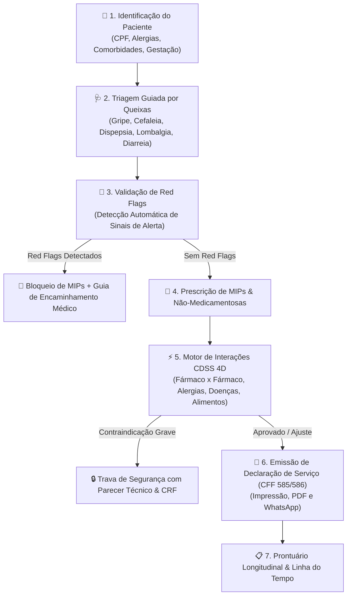

# CRM Clínico Farmacêutico & Suporte à Decisão Clínica (CDSS 4D)

Plataforma de alta performance para **Cuidado Farmacêutico, Triagem Clínica Guiada (< 60s), Prescrição Segura de MIPs e Motor de Cruzamento de Interações em Tempo Real**, em conformidade com as **Resoluções CFF nº 585/2013 e 586/2013** e normas da **ANVISA**.

---

## 🌿 Pilares Centrais do Sistema



---

## 💎 Características e Diferenciais

1. **🩺 Balcão de Atendimento & Triagem Rápida (< 60s)**
   - Árvores de decisão clínica com protocolos estruturados para as queixas mais comuns de balcão.
   - Detecção em tempo real de sinais de alarme (*Red Flags*), bloqueando a dispensação indevida de MIPs e emitindo a Guia de Encaminhamento Médico.

2. **⚡ Motor de Suporte à Decisão Clínica (CDSS 4D)**
   - Validação cruzada multidimensional instantânea:
     - **Fármaco x Fármaco (DDI)**: Detecção de sinergismos e antagonismos (ex.: *Nitrato + PDE-5*, *Varfarina + AINEs*, *ISRS + Tramadol*).
     - **Fármaco x Alergias**: Alertas de reatividade cruzada (ex.: *Dipirona / Pirazolonas*, *Penicilinas*).
     - **Fármaco x Comorbidades**: Restrições em hipertensos, diabéticos, insuficiência renal ou hepática.
     - **Fármaco x Alimentos/Hábitos**: Interações com álcool, alimentos ricos em vitamina K, etc.
   - **Trava de Segurança Clínica**: Exigência obrigatória de parecer técnico justificado e registro de CRF para prosseguir em alertas contraindicados.

3. **🧠 Busca Dinâmica de Medicamentos via PLN (Processamento de Linguagem Natural)**
   - **Fuzzy Matching com Levenshtein**: Localiza fármacos mesmo com erros de digitação (`"iboprofeno"`, `"parasetamol"`, `"clonasepan"`).
   - **NER Clínico**: Identifica automaticamente dosagens (`500mg`, `1g`, `200mg/ml`) e formas farmacêuticas (`comprimido`, `gotas`, `xarope`).
   - **Mapeamento de Sintomas Leigos**: Converte queixas (`"dor de garganta"`, `"refluxo"`, `"pressão alta"`) diretamente nas classes terapêuticas apropriadas.

4. **📜 Declaração de Serviço Farmacêutico (Resoluções CFF 585/586)**
   - Geração com 1 clique de documentos clínicos oficiais contendo histórico da queixa, conduta não-farmacológica, posologia e dados do farmacêutico.
   - Exportação em PDF, impressão formatada e envio direto para o WhatsApp do paciente.

5. **📋 Prontuário Longitudinal Farmacoterapêutico**
   - Linha do tempo de atendimentos anteriores, fórmulas manipuladas, adesão ao tratamento e previsão de término de medicamentos contínuos.

6. **☁️ Sincronização em Nuvem (Turso LibSQL)**
   - Arquitetura offline-first com sincronização bidirecional atômica entre navegadores e banco de dados Turso na nuvem.

---

## 🚀 Como Executar

### 1. Instalação e Execução Local
```bash
# Instalar dependências
npm install

# Iniciar ambiente de desenvolvimento
npm run dev
```

### 2. Build de Produção
```bash
npm run build
```

---

## 🛠️ Stack Tecnológica

- **Frontend:** SPA Modular Vanilla JavaScript (ES Modules) · Vite 5 · jsPDF · Chart.js
- **Design System:** Frosted Glassmorphism autoral (Deep Teal, Emerald Jade, Ruby Crimson, Obsidian Slate)
- **Backend:** Node.js + Express API REST (Vercel Serverless Functions)
- **Banco de Dados:** Turso Cloud (LibSQL) + Local Storage / IndexedDB Offline-First
- **Conformidade Regulatória:** CFF 585/2013, CFF 586/2013, ANVISA RDC
