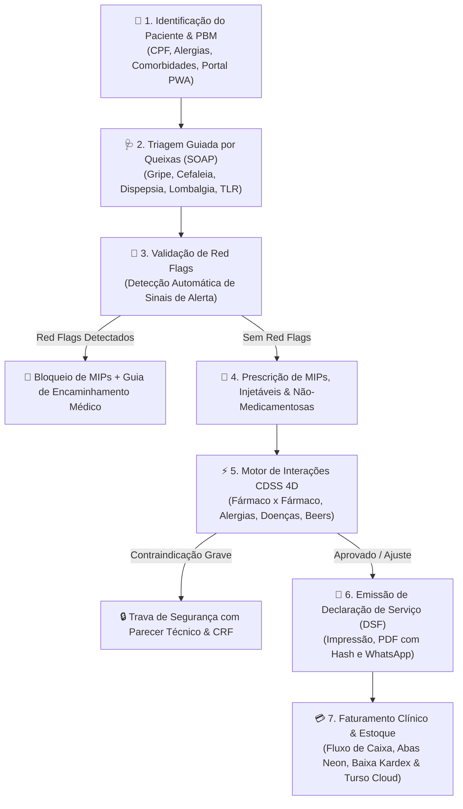

# CRM Clínico Farmacêutico & Suporte à Decisão Clínica (CDSS 4D) v3.0

Plataforma integrada de alta performance para **Cuidado Farmacêutico, Triagem Clínica Guiada (< 60s), Prescrição Segura de MIPs, Motor de Cruzamento de Interações em Tempo Real, Controle Financeiro & Fluxo de Caixa, Gestão de Estoque com Código de Barras, Portal do Paciente PWA e Governança Regulatória**, em estrita conformidade com as **Resoluções CFF nº 585/2013 e 586/2013** e normas da **ANVISA (RDC 44/2009 & RDC 786/2023)**.

---

## 🌿 Pilares Centrais do Sistema



---

## 💎 Módulos e Diferenciais da Versão 3.0

### 1. 🩺 Balcão de Atendimento, Triagem SOAP & CDSS 4D (< 60s)
- **Triagem Farmacêutica Guiada**: Árvores de decisão clínica para as queixas mais comuns do balcão (Gripe, Azia, Cefaleia, Rinite, Lombalgia, Diarreia).
- **🚨 Rastreio Precoce de Sepse (*Surviving Sepsis Campaign* / qSOFA)**: Avaliação em tempo real dos critérios da SCCM/ESICM (PAS $\le$ 100 mmHg, FR $\ge$ 22 irpm, alteração de consciência e temperatura) com bloqueio automático de MIPs e geração de Guia de Encaminhamento de Urgência (CFF nº 585/2013).
- **🎙️ Ditado Clínico por Voz (Web Speech API)**: Transcrição contínua e em tempo real em Português (*pt-BR*) nos campos livres da anamnese e parecer técnico.
- **📹 Teleconsulta Farmacêutica WebRTC**: Sala de teleatendimento com vídeo/áudio HD ponto a ponto, compartilhamento de tela e preenchimento de prontuário SOAP simultâneo.
- **Motor CDSS 4D Multidimensional**:
  - *Fármaco x Fármaco*: Detecção em tempo real de contraindicações graves (ex.: Sinvastatina + Claritromicina, Varfarina + AINEs).
  - *Fármaco x Alergias*: Alertas de reatividade cruzada (Penicilinas, Dipirona, AINEs, Sulfas).
  - *Fármaco x Comorbidades & Beers*: Travas de segurança para idosos, hipertensos, diabéticos e renais crônicos.
  - *Fármaco x Alimentos & Hábitos*: Orientações alimentares personalizadas.
- **Red Flags**: Bloqueio imediato de MIPs com emissão de Guia de Encaminhamento Médico de urgência.
- **📜 Janela Modal de Consulta da DSF & PDF Vetorial Direto**: A Declaração de Serviço Farmacêutico (DSF) é aberta em modal interativo para pré-visualização completa antes da emissão. O farmacêutico pode baixar o arquivo vetorial A4 de alta definição diretamente (sem acionar a caixa de diálogo de impressão do navegador), enviar para o WhatsApp ou faturar no PDV.
- **Vacinação & Injetáveis (CFF 654/2018)**: Registro de via, músculo, lote e emissão de comprovante.
- **Despacho Posológico via WhatsApp**: Envio instantâneo e formatado das instruções ao celular do paciente.

---

### 2. 💰 Controle Financeiro, PDV Rápido & PIX Dinâmico BACEN
- **⚡ PIX Dinâmico com QR Code Oficial BACEN**: Geração do payload oficial EMV (BR Code) com valor exato, cálculo de CRC16 e botão "PIX Copia e Cola" no PDV e na baixa de títulos.
- **Abas Neon de Alto Contraste**: Navegação rápida e visual entre `Todos os Lançamentos`, `⬇️ Receitas & Faturamento Clínico` e `⬆️ Despesas & Custos Operacionais`.
- **Boletos Bancários FEBRABAN**: Emissão e download direto em PDF sem descaracterização.
- **DRE Executivo & Extrato**: Acompanhamento de receitas brutas, custos de insumos/distribuidoras, despesas fixas e margem líquida com exportação em PDF.

---

### 3. 📦 Controle de Estoque, Catálogo & Leitor de Código de Barras
- **Scanner Óptico & Câmera**: Leitura instantânea de código de barras (EAN-13) pela webcam, celular ou leitor USB.
- **Rastreabilidade de Lotes & Validade**: Alertas visuais para produtos próximos do vencimento (< 90 dias) e controle de ponto de pedido/reposição.
- **Curva ABC & Ajuste Físico**: Ajustes rápidos de inventário com justificativa formal (quebras, avarias, acertos periódicos).

---

### 4. 👤 Prontuário Longitudinal, Ergonomia & Portal do Paciente PWA ("Minha Saúde")
- **Prontuário Completo com Reemissão de DSF**: Timeline cronológica de consultas SOAP, aferições vitais (PA, Glicemia, IMC), exames TLR e histórico de prescrições. Cada atendimento conta com o botão dedicado **"Visualizar / Exportar DSF"**.
- **Ergonomia e Interface Focada**: Remoção de botões redundantes na listagem de pacientes; menu suspenso de PBMs dinamicamente posicionado sem sobrepor campos de digitação.
- **Histórico de Compras & Adesão (`🛒`)**: Acompanhamento de compras realizadas, medicamentos dispensados, previsão de término de uso contínuo (*Refill*) e lembrete direto via WhatsApp.
- **PWA do Paciente (`📱`)**: Simulador do smartphone do paciente com carteirinha digital de vacinação, histórico de Declarações de Serviços Farmacêuticos (DSF) e despertador inteligente de remédios.

---

### 5. 📚 Manuais & Documentações Oficiais do Sistema
- 📘 **[Manual do Usuário — Guia Passo a Passo Completo (PDF)](file:///c:/CRM%20Cl%C3%ADnico%20Farmac%C3%AAutico/Manual_do_Usuario_CRM_Clinico_Farmaceutico.pdf)**: Guia operacional completo de alta fidelidade diagramado em A4 com cenários reais de balcão, simulação multiprofissional MEWS, controle de estoque e configurações (`npm run build:manual`).
- 📖 **Manual Interativo Integrado no Sistema**: Acessível em qualquer tela pelo botão do manual ou atalhos, com busca semântica em linguagem natural e navegação direta para os módulos.
- 📄 **[Relatório Executivo & Ficha Técnica (PDF)](file:///c:/CRM%20Cl%C3%ADnico%20Farmac%C3%AAutico/Relatorio_Executivo_CRM_Clinico_Farmaceutico.pdf)**: Resumo estratégico para diretoria e auditoria sanitária com os 7 pilares (`npm run build:pdf`).

---

### 6. ⚙️ Central de Configurações em 7 Agrupamentos Estruturados
1. **👥 Gestão de Operadores, RBAC & Instruções de Acesso**: Controle seguro de acessos (Master, Farmacêutico RT, Farmacêutico Clínico, Administrador, Atendente) sob política de proteção de credenciais.
2. **☁️ Banco Turso Cloud (LibSQL Distribuído)**: Monitoramento do cluster na nuvem com detecção inteligente de atualizações (Modais Roxo/Laranja no Vercel).
3. **🏢 Dados da Farmácia & RT**: Razão social, CNPJ e registro CRF-SP para chancela de documentos.
4. **💾 Backup & Restauração JSON**: Exportação e importação criptografada de segurança.
5. **📖 Protocolos Clínicos & Manual Interativo**: 6 protocolos integrados com dosagens e fluxogramas.
6. **🧪 Sandbox & HARD RESET Atômico**: Purga integral e sincronizada de atendimentos, compras, vendas PDV e dados transacionais de teste no LocalDB e na nuvem Turso, garantindo 0 resíduos no sistema com autenticação Master.
7. **🏷️ Gestão de Parâmetros Financeiros**: Painel CRUD completo para gerenciar categorias de receitas, despesas e meios de pagamento vinculados aos botões `+`.

---

## 🚀 Como Executar

### 1. Instalação e Execução Local
```bash
# Instalar dependências
npm install

# Iniciar ambiente de desenvolvimento Vite
npm run dev
```

### 2. Build de Produção
```bash
npm run build
```

---

## 🛠️ Stack Tecnológica

- **Frontend:** SPA Vanilla JavaScript Modular (ES Modules) · Vite 5 · Chart.js · jsPDF · FontAwesome 6 Pro · Google Fonts Outfit/Inter
- **Design System:** Dark Mode Glassmorphism com paleta Neon HSL (Emerald, Cyan, Violet, Rose, Amber)
- **Backend & Cloud:** Turso LibSQL Cloud Cluster + Vercel Serverless Functions
- **Persistência:** Arquitetura Offline-First (LocalDB / IndexedDB / LocalStorage) com reconciliação atômica
- **Conformidade Sanitária:** CFF nº 585/2013, CFF nº 586/2013, CFF nº 654/2018, ANVISA RDC nº 44/2009 e RDC nº 786/2023.

