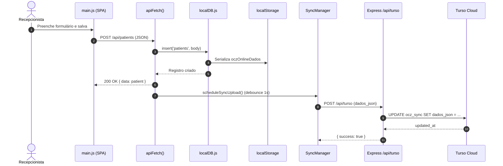

# CRM Clínico Farmacêutico — Arquitetura Geral de Software

> **Versão do documento:** 2.7.2 (alinhado ao código em produção)  
> **Última atualização:** Agosto 2026  
> **Arquitetura atual:** Modular Offline-First (SPA Modular + localStorage + Dual-Pipeline Turso Cloud)

Este documento descreve a arquitetura **implementada** na v2.7.2 do CRM Clínico Farmacêutico.

---

## 1. Diagrama de Camadas (v2.7.2)

O sistema opera como um **monólito híbrido local-first modular**: a interface e lógica de negócio são organizadas em submódulos especializados sob `src/modules/`, orquestrados por `src/main.js` e consumidos pelas abas em `src/tabs/`. A persistência reside no navegador (`localStorage`) com sincronização atômica para a nuvem Turso via Dual-Pipeline (Vercel API Proxy + Fallback Direto HTTP LibSQL).

```mermaid
graph TD
    User([Usuário / Navegador]) <-->|HTTPS| SPA[SPA Modular — src/main.js & src/tabs/*]

    subgraph ClientLayer [Camada Cliente — Navegador / src/modules/]
        SPA
        UIMod[src/modules/ui.js — Temas, Modais, Toasts]
        APIMod[src/modules/api.js — apiFetch, Cache, Summary Dinâmico]
        SyncMod[src/modules/sync.js — SyncManager Dual-Pipeline]
        AuthMod[src/modules/auth.js — RBAC & Auditoria de Sessões]
        LocalDB[src/localDB.js — CRUD localStorage]
    end

    subgraph ServerLayer [Servidor Node.js / Express & Vercel]
        Express[backend/app.js]
        TursoProxy[/api/turso — Proxy Serverless]
    end

    subgraph Persistence [Persistência]
        LS[(localStorage — oczOnlineDados)]
        Turso[(Turso LibSQL — ocz_sync snapshot JSON)]
    end

    SPA --> UIMod
    SPA --> AuthMod
    SPA --> APIMod
    SPA --> SyncMod
    APIMod --> LocalDB
    LocalDB --> LS
    SyncMod -->|Pipeline 1: Proxy| TursoProxy
    TursoProxy --> Turso
    SyncMod -.->|Pipeline 2: Fallback Direto HTTP| Turso
```

### Detalhamento dos Módulos Frontend (`src/modules/`)

1. **`src/modules/ui.js`**: Gestão completa de interface: controle de tema Dark/Light, gradientes para gráficos Chart.js, select customizado com busca rápida (`setupCustomSelect`), modais de confirmação/alerta (`showCustomAlert`, `showCustomConfirm`, `showLoadingModal`, `hideLoadingModal`) e toasts dinâmicos.
2. **`src/modules/api.js`**: Roteador interceptador local-first `apiFetch`, cache TTL em memória (`cachedApiGet`), invalidação inteligente (`invalidateCacheForUrl`), formatadores de segurança (`anonymizeCPF`, `abbreviateName`, `removeAccents`) e agregação dinâmica de métricas para `/api/dashboard/summary`.
3. **`src/modules/sync.js`**: Módulo de sincronização com **Dual-Pipeline Turso** (Proxy Vercel + Direct HTTP LibSQL fallback com timeout de 15s e retentativas), detecção de versão por timestamp ISO/numérico, modais de comparação e auto-sync a cada 15 minutos.
4. **`src/modules/auth.js`**: Matriz de permissões hospitalares (`getRolePermissions`), auditoria de acessos (`showUserSessionsHistory`), gerenciamento e formulários de cadastro/edição de usuários (`showUserManagementModal`, `showUserFormModal`).
5. **`src/localDB.js`**: Camada de persistência local. Armazena entidades em `localStorage` (`oczOnlineDados`). Expõe `list`, `get`, `insert`, `update`, `remove`.
6. **Turso (LibSQL)**: Nuvem edge distribuída. Sincroniza o snapshot atômico na tabela `ocz_sync` (`dados_json`, `config_json`, `updated_at`).

---

## 2. Ciclo de Vida de uma Requisição (v1.0.1)

Exemplo: cadastro de um paciente via `POST /api/patients`.



### Fluxo de autenticação

1. Usuário submete login na tela de autenticação (`username` + `password`).
2. `apiFetch('/api/auth/login')` busca o usuário e valida a senha informada em `user.password`.
3. Caso a senha esteja incorreta, o acesso é negado com HTTP 401 ("Senha incorreta. Verifique suas credenciais.").
4. Se o usuário for válido e ativo, o token de sessão é armazenado em `sessionStorage` (`hn_token`, `hn_user`).
5. RBAC aplicado via `getRolePermissions()` ao renderizar a estrutura da aplicação.

> **Autenticação e Segurança (v1.3.0):** Validação estrita de senha e sincronização de credenciais ativas no Turso Cloud DB implementadas. Ver `docs/07-Seguranca/01-autenticacao-autorizacao.md`.

---

## 3. Tratamento de Erros (v1.0.1)

No cliente, `apiFetch()` retorna um objeto mock de `Response` com `ok`, `status` e `json()`. Erros de persistência local são capturados em bloco `try/catch` e retornam status 500 com `{ message }`.

No backend (`backend/app.js`), erros de sync Turso retornam:
```json
{ "error": "Erro interno de sincronização" }
```

Rotas inexistentes retornam:
```json
{ "error": "Rota relacional legada não existe mais. Use offline-first architecture." }
```

### Roadmap — Tratamento global de erros (v2.0)

Na arquitetura-alvo com backend REST completo, erros seguirão o padrão `AppError` com middleware global Express, retornando:
```json
{
  "status": "error",
  "statusCode": 400,
  "message": "Mensagem descritiva",
  "errors": []
}
```

---

## 4. Cache e Performance (v1.0.1)

| Mecanismo | Implementação | TTL |
|-----------|---------------|-----|
| Cache de dados da API | `dataCache` (Map) em `main.js` | 30 segundos |
| Persistência local | `localStorage` | Permanente (até reset) |
| Sync cooldown | `SyncManager.cooldownMs` | 60 segundos |
| Auto-sync | `SyncManager.syncIntervalMs` | 15 minutos |

Não há Redis nem cache server-side na v1.0.1.

### Roadmap — Redis e filas (v2.0)

Planejado para ambientes multi-instância:
- Cache de tabelas de referência (CID-10, TUSS, IBGE)
- Blacklist de tokens JWT
- Filas assíncronas (WhatsApp, exportação TISS, IA)

---

## 5. Entidades Lógicas (tabelas em JSON)

O banco local é um objeto JSON com chaves de coleção. Principais entidades:

| Chave localStorage | Descrição |
|--------------------|-----------|
| `users` | Usuários e perfis RBAC |
| `patients` | Cadastro de pacientes |
| `encounters` | Atendimentos / fila Kanban |
| `appointments` | Agenda de consultas |
| `triages` | Triagens Manchester |
| `clinical_notes` | Prontuário SOAPE |
| `prescriptions` | Prescrições médicas |
| `pharmacy_items` | Estoque farmácia |
| `beds` | Mapa de leitos |
| `financial_installments` | Parcelas financeiras |
| `tv_calls` | Chamadas do painel TV |

Detalhes em `docs/04-Banco-de-Dados/02-dicionario-dados-global.md`.

---

## 6. Extensibilidade e Roadmap

### v1.0.1 — Estado atual
- Integração ViaCEP (autocomplete de endereço no frontend)
- Exportação PDF/XLSX/CSV (jsPDF, SheetJS)
- Web Speech API (painel TV)
- Sync Turso (blob JSON)

### v2.0 — Planejado
- **Adapters**: interfaces para WhatsApp, FHIR, gateways bancários
- **Event-driven**: `EventEmitter` ou Redis Pub/Sub para `patient.admitted`, `encounter.completed`
- **Backend REST real**: controllers/services/repositories com PostgreSQL ou Turso relacional
- **WebSockets**: Socket.io para triagem, leitos e revogação de sessão em tempo real
- **Modularização**: separar `main.js` em módulos por aba (`src/modules/`)

---

## 7. Limitações Conhecidas (v1.0.1)

| Limitação | Impacto |
|-----------|---------|
| Dados em `localStorage` (~5–10 MB) | Volume limitado de registros |
| Sync como blob JSON | Sem integridade referencial; conflitos multi-usuário |
| RBAC só no frontend | Não impede manipulação via DevTools |
| Monolito `main.js` (~13k linhas) | Manutenção e testes difíceis |
| Sem testes automatizados | Regressões não detectadas automaticamente |

Estas limitações são aceitáveis para **demonstração, prototipagem e piloto controlado**, mas bloqueiam uso clínico em produção sem as evoluções da v2.0.
