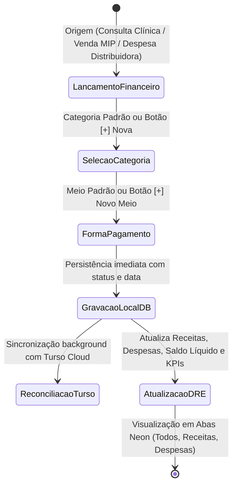
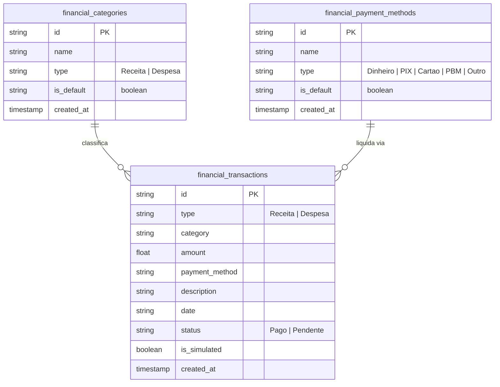

# CRM Clínico Farmacêutico — Módulo 11: Financeiro & Fluxo de Caixa

Este documento detalha os requisitos e especificações para o módulo **Financeiro & Fluxo de Caixa** do CRM Clínico Farmacêutico v3.0.

---

## 1. Objetivo
Gerenciar integralmente a saúde financeira da farmácia/consultório: faturamento de consultas farmacêuticas, testes laboratoriais remotos (TLR / RDC 786), aplicação de injetáveis e vacinas, dispensação de MIPs, controle de custos de aquisição (distribuidoras), despesas operacionais fixas e variáveis, DRE em tempo real e conciliação de meios de pagamento.

---

## 2. Fluxo de Processo (Workflow)
O fluxo gerencia receitas originadas dos atendimentos clínicos e vendas no PDV, despesas de suprimentos e custos fixos, com sincronização em tempo real com a nuvem Turso e gestão de parâmetros personalizáveis.

---

## 3. Regras de Negócio e Funcionalidades Principais

1. **Abas Neon de Alto Contraste**: Navegação e filtragem rápida do extrato financeiro em 3 abas visualmente diferenciadas:
   - `Todos os Lançamentos`: Visão unificada cronológica.
   - `⬇️ Receitas & Faturamento`: Entradas filtradas com totalizadores de receitas clínicas e vendas.
   - `⬆️ Despesas & Custos`: Saídas filtradas com totalizadores de compras de estoque, impostos e custos fixos.
2. **Botões de Cadastro Rápido `+` (Criação Dinâmica de Parâmetros)**:
   - No modal de novo lançamento, botões `+` ao lado dos seletores de *Categoria* e *Forma de Pagamento* permitem criar instantaneamente novos itens sem sair do formulário.
   - Todo item cadastrado pelo botão `+` é gravado no banco de dados, sincronizado na nuvem e exibido no **Agrupamento 7 da aba Configurações** com o selo `⭐ Personalizado (via +)`.
3. **Gestão Centralizada de Parâmetros (`src/modules/financialParams.js`)**:
   - Painel CRUD na aba Configurações que permite pesquisar, editar (renomear/reclassificar) e excluir qualquer categoria ou meio de pagamento.
4. **DRE Farmacêutico em Tempo Real**:
   - Apuração do Demonstrativo de Resultados do Exercício (Receita Bruta - Custos de Mercadorias Vendidas - Despesas Operacionais = Lucro/Prejuízo Líquido).
   - Exportação em PDF com cabeçalho do estabelecimento farmacêutico e dados do Responsável Técnico.

---

## 4. Banco de Dados (Coleções LocalDB & Turso Cloud)

## 5. Casos de Uso

| ID | Caso de Uso | Ator Principal | Pré-condições | Fluxo Principal |
| :--- | :--- | :--- | :--- | :--- |
| **UC-1101** | Lançamento Rápido com Criação de Parâmetro `+` | Farmacêutico / Admin | Modal de Lançamento aberto | 1. Informa se é Receita ou Despesa; 2. Clica no `+` para criar nova categoria personalizada; 3. O sistema salva na coleção `financial_categories`, seleciona no campo e sincroniza no Turso Cloud; 4. Preenche valor e data; 5. Confirma gravação. |
| **UC-1102** | Filtragem Dinâmica por Abas Neon | Farmacêutico / Admin | Aba Financeiro aberta | 1. Clica na aba `⬇️ Receitas` ou `⬆️ Despesas`; 2. O grid recalcula totais e exibe apenas transações do tipo selecionado com destaque visual. |
| **UC-1103** | Gestão de Parâmetros Financeiros | Master / RT | Agrupamento 7 de Configurações | 1. Pesquisa categoria ou meio de pagamento; 2. Clica em ✏️ Editar para alterar nome/tipo ou 🗑️ Excluir para remover; 3. Atualiza os formulários instantaneamente. |

---

## 6. Perfis e Permissões (RBAC)
* **Master (`mazzarowysk`) / Farmacêutico RT**: Acesso pleno ao fluxo de caixa, DRE, conciliação, criação, edição e exclusão de parâmetros no Agrupamento 7.
* **Farmacêutico Clínico**: Registro de receitas de procedimentos e consultas realizadas no balcão.
* **Administrador**: Gestão do contas a pagar/receber, custos operacionais e relatórios gerenciais.

---

*CRM Clínico Farmacêutico v3.0 — Módulo 11: Financeiro*
