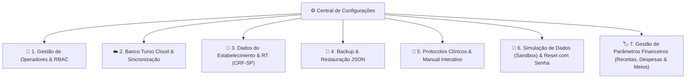

# CRM Clínico Farmacêutico — Módulo 15: Configurações & Gestão Central

Este documento detalha os requisitos e especificações para a aba de **Configurações & Gestão do Sistema** do CRM Clínico Farmacêutico v3.0.

---

## 1. Objetivo
Centralizar a administração global do consultório e farmácia através de uma interface moderna em formato de acordeão com **7 Agrupamentos Estruturados**, integrando governança clínica, segurança de dados, nuvem Turso e gestão de parâmetros operacionais.

---

## 2. Estrutura dos 7 Agrupamentos Estruturados

---

## 3. Especificação Detalhada por Agrupamento

### 👥 Agrupamento 1: Gestão de Operadores & Perfis (RBAC)
- Cadastro de novos operadores com login `@username`, nome, função, registro profissional (ex: `CRF-SP 54180`) e senha.
- Edição de perfis existentes, visualização de histórico de sessões e exclusão segura.
- O usuário Master `mazzarowysk` possui privilégios totais e imutáveis.

### ☁️ Agrupamento 2: Banco Turso Cloud & Sincronização Distribuída
- Monitoramento de latência e status do cluster LibSQL na nuvem.
- Modo Offline-First com reconciliação automática de timestamps.
- Gatilho automático dos modais de detecção de versões (Roxo = Baixar nuvem / Laranja = Enviar local).

### 🏢 Agrupamento 3: Dados do Estabelecimento & Farmacêutico RT
- Parametrização de Razão Social, Nome Fantasia, CNPJ, Endereço e Telefone.
- Nome do Farmacêutico(a) Responsável Técnico e registro CRF-UF para estampagem automática em Declarações de Serviços Farmacêuticos (DSF) e DRE.

### 💾 Agrupamento 4: Backup & Restauração JSON
- Exportação com 1 clique de arquivo JSON contendo todas as coleções do banco local.
- Importação e restauração com validação de esquema de dados.

### 📖 Agrupamento 5: Protocolos Clínicos & Manual Interativo
- Consulta aos 6 protocolos clínicos de triagem de MIPs (Gripe, Azia, Cefaleia, Rinite, Lombalgia, Diarreia).
- Acesso ao manual interativo por abas com mecanismo de busca semântica em tempo real.

### 🧪 Agrupamento 6: Simulação de Dados (Sandbox) & Limpeza de Bases
- **Geradores Rápidos de 1 Clique**:
  - `👥 Gerar 5 Clientes`: Pacientes com CPF e endereços simulados.
  - `🩺 Gerar 5 Atendimentos`: Registros SOAP e prescrições de MIPs.
  - `📦 Gerar 5 Entradas de Estoque`: Insumos com lotes e validades.
  - `💳 Gerar 8 Lançamentos Financeiros`: Transações simuladas no fluxo de caixa.
- **Gestão e Limpeza de Bases Segura**:
  - `🧹 Limpar Base de Simulação`: Remove registros marcados com `[SIMULADO]` (autenticado por senha).
  - `⚠️ Limpar Cadastros Reais`: Remove cadastros de produção preservando usuários (autenticado por senha Master + palavra de confirmação `"LIMPAR"`).
  - `💥 Hard Reset de Fábrica`: Redefine o banco para o estado zero inicial (autenticado por senha Master + confirmação `"HARD RESET"`).

### 🏷️ Agrupamento 7: Gestão de Parâmetros Financeiros (Receitas, Despesas & Meios)
- Painel integrado com 4 KPIs: total de categorias de receita, categorias de despesa, formas de pagamento e total geral.
- Filtros rápidos (`Todos`, `Receitas`, `Despesas`, `Pagamentos`) e busca instantânea.
- Botão `+ Novo Parâmetro` para inclusão manual direta.
- Ações completas para cada item: ✏️ **Editar** (renomear/reclassificar) e 🗑️ **Excluir**.
- **Sincronização Automática**: Qualquer categoria ou forma de pagamento criada no fluxo financeiro pelo botão `+` é automaticamente sincronizada, persistida e listada neste agrupamento com o selo `⭐ Personalizado (via +)`.

---

## 4. Perfis de Permissão (RBAC)

| Perfil | Acesso aos Agrupamentos 1 a 5 | Sandbox / Geradores (G6) | Limpeza / Hard Reset (G6) | Gestão de Parâmetros (G7) |
| :--- | :---: | :---: | :---: | :---: |
| **👑 Master (`mazzarowysk`)** | ✅ Total | ✅ Total | ✅ Total (com senha) | ✅ Total (CRUD) |
| **💊 Farmacêutico RT** | ✅ Total | ✅ Leitura | ❌ Bloqueado | ✅ Total (CRUD) |
| **🛠️ Administrador** | ✅ Visualização | ✅ Leitura | ❌ Bloqueado | ✅ Consulta |
| **🩺 Farmacêutico Clínico** | ❌ Restrito | ❌ Bloqueado | ❌ Bloqueado | ❌ Bloqueado |
| **📋 Atendente** | ❌ Restrito | ❌ Bloqueado | ❌ Bloqueado | ❌ Bloqueado |

## 5. Casos de Uso

| ID | Caso de Uso | Ator Principal | Pré-condições | Fluxo Principal |
| :--- | :--- | :--- | :--- | :--- |
| **UC-1501** | Cadastrar e Editar Operadores | Master (`mazzarowysk`) | Aba Configurações aberta | 1. Abre Agrupamento 1; 2. Preenche Nome, @username, Perfil e CRF; 3. Salva e sincroniza na nuvem. |
| **UC-1502** | Gerar Dados de Simulação (Sandbox) | Master / RT | Agrupamento 6 aberto | 1. Clica no gerador desejado (+5 Clientes, +5 Atendimentos, +5 Estoque ou +8 Financeiro); 2. O sistema gera registros com tag `[SIMULADO]` e atualiza os dashboards. |
| **UC-1503** | Limpeza Seletiva ou Hard Reset | Master | Agrupamento 6 aberto | 1. Clica no botão de limpeza; 2. Modal de segurança solicita senha (e digitação de `"LIMPAR"` / `"HARD RESET"`); 3. Sistema valida credenciais e executa a limpeza atômica. |
| **UC-1504** | Gestão de Parâmetros de Receita/Despesa | Master / RT | Agrupamento 7 aberto | 1. Visualiza tabela de categorias e meios de pagamento; 2. Edita ou exclui registros; 3. Atualiza os formulários de lançamento do balcão e financeiro. |

---

*Documentação de Requisitos — CRM Clínico Farmacêutico v3.0 — Agosto/2026*
