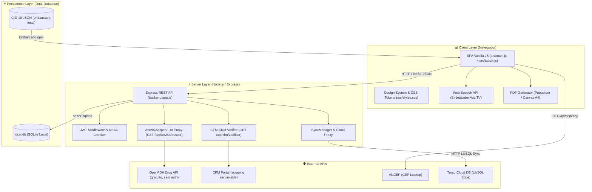
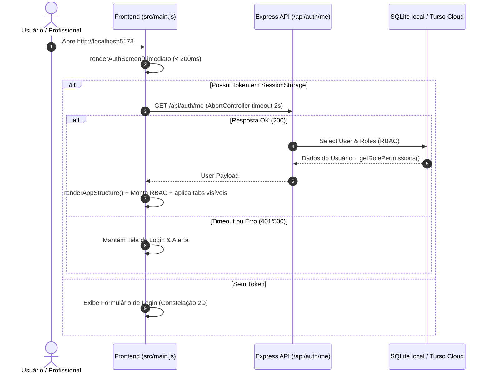
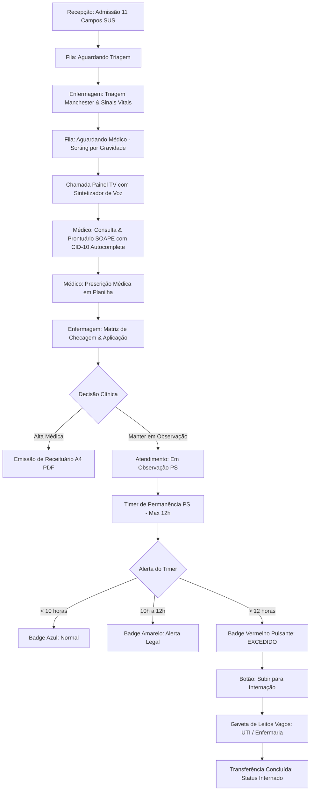
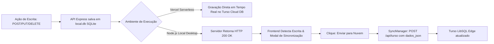
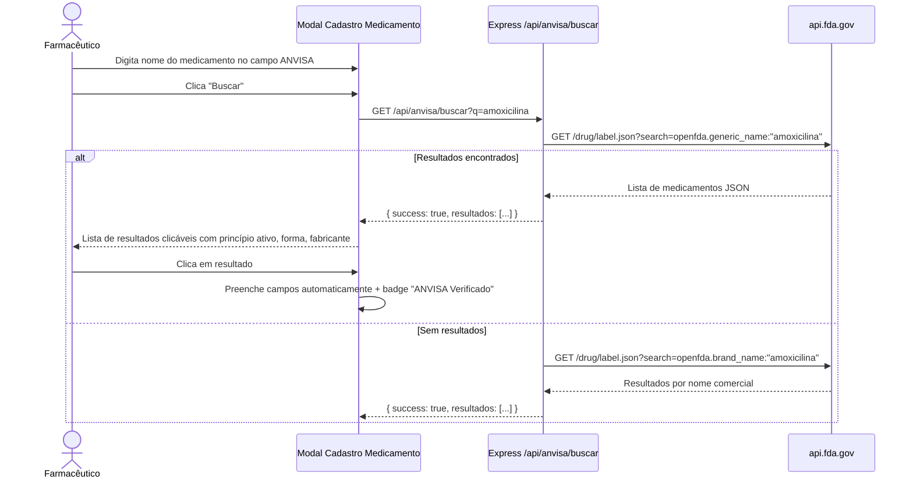

# 💻 CRM Clínico Farmacêutico — Guia Completo do Desenvolvedor & Arquitetura de Software

> **Versão:** 1.3.0  
> **Arquitetura:** Monólito Híbrido Local-First (Vanilla JS Single Page Application + Express REST API + Dual-Database SQLite/Turso LibSQL)  
> **Última Atualização:** Agosto/2026

---

## 📐 1. Organograma da Arquitetura do Sistema

O **CRM Clínico Farmacêutico** foi construído com separação limpa de responsabilidades, mantendo extrema simplicidade operacional (zero frameworks pesados no frontend, performance instantânea < 5ms localmente).



---

## 🔄 2. Fluxogramas dos Processos Principais

### 2.1 Fluxograma de Inicialização & Autenticação



---

### 2.2 Fluxograma de Atendimento, Prescrição & Observação PS



---

### 2.3 Fluxograma da Sincronização Local-First ↔ Cloud Turso



---

### 2.4 Fluxograma de Busca ANVISA (Farmácia)



---

## 📊 3. Rotas da API REST (Endpoints Ativos)

Toda a API REST está concentrada em `backend/app.js`.

### 3.1 Autenticação e Usuários

| Método | Endpoint | Descrição | Permissão |
|--------|----------|-----------|-----------|
| `POST` | `/api/auth/login` | Autentica usuário e retorna Token JWT + Perfil | Público |
| `POST` | `/api/auth/register` | Cadastro de novo usuário (status Pendente) | Público |
| `GET` | `/api/auth/me` | Valida sessão ativa e retorna dados do perfil | Logado |
| `GET` | `/api/users` | Lista todos os usuários cadastrados | Admin / Master / Desenvolvedor |
| `PUT` | `/api/users/:id/approve-master` | Aprova ou rejeita cadastro de acesso | Apenas Master |
| `DELETE` | `/api/users/:id` | Soft-delete em conta de usuário | Master |

### 3.2 Pacientes e Atendimentos

| Método | Endpoint | Descrição | Permissão |
|--------|----------|-----------|-----------|
| `GET` | `/api/patients` | Lista pacientes (busca por nome, CPF, ID) | Todos logados |
| `POST` | `/api/patients` | Admissão com campos SUS | Recepcionista, Master |
| `PUT` | `/api/patients/:id` | Atualiza dados cadastrais | Recepcionista, Master |
| `DELETE` | `/api/patients/:id` | Move para Lixeira de Segurança | Apenas Master |
| `GET` | `/api/appointments` | Lista agendamentos (filtrável por data) | Todos logados |
| `GET` | `/api/encounters` | Lista atendimentos ativos/histórico | Todos logados |
| `POST` | `/api/encounters/:id/start-observation` | Inicia timer de observação PS | Médico, Enfermeiro, Master |

### 3.3 Infraestrutura e Integrações

| Método | Endpoint | Descrição |
|--------|----------|-----------|
| `ALL` | `/api/turso` | Sincronização bidirecional com Turso Cloud |
| `GET` | `/api/cep/:cep` | Proxy ViaCEP para autocompletar endereço |
| `GET` | `/api/anvisa/buscar?q=` | **[NOVO]** Busca de medicamentos via OpenFDA |
| `GET` | `/api/cfm/verificar?crm=&uf=` | **[NOVO]** Verificação de CRM médico via CFM Portal |
| `GET` | `/api/sync/cloud-status` | Verifica status da sincronização cloud |
| `GET/POST` | `/api/tv/call` | Chamada de pacientes no painel TV |
| `GET` | `/api/consulting-rooms` | Lista consultórios disponíveis |

---

## 🎛️ 4. Sistema de Controle de Acesso (RBAC)

O acesso às abas e funcionalidades é gerenciado pela função `getRolePermissions(role)` em `src/main.js`.

### Perfis de Usuário

| Perfil | Acesso | Aba Configurações |
|--------|--------|------------------|
| **Master** | Todas as abas + todas as configs | ✅ Acesso total |
| **Desenvolvedor** | Todas as abas + grupos técnicos de configuração | ✅ Grupos técnicos |
| **Administrador** | Abas administrativas + clínicas | ❌ Sem acesso |
| **Médico** | Agenda, PEP, Prontuário, Internação | ❌ Sem acesso |
| **Enfermeiro** | Triagem, Prescrição, Leitos | ❌ Sem acesso |
| **Recepcionista** | Admissão, Agenda, Fila | ❌ Sem acesso |
| **Farmacêutico** | Farmácia, Dispensação | ❌ Sem acesso |
| **Financeiro** | Relatórios Financeiros, Faturamento | ❌ Sem acesso |
| **Pendente** | Apenas tela de espera de aprovação | ❌ Sem acesso |

### Grupos de Configurações por Perfil

**Master** → Acesso a todos os grupos  
**Desenvolvedor** → Acesso apenas aos grupos marcados como técnicos:
- Configurações Gerais do Sistema
- Gestão de Usuários & Permissões
- Integrações & APIs
- Banco de Dados & Sincronização
- Segurança & Compliance

---

## 🛠️ 5. Estrutura de Pastas

```
Health-Nexus/
├── backend/
│   ├── app.js              # Express REST API — todas as rotas
│   ├── database/
│   │   └── client.js       # Configuração SQLite (better-sqlite3) + migrações
│   └── server.js           # Entry point Express standalone
├── docs/                   # Documentação técnica completa (esta pasta)
├── public/
│   ├── manual_do_usuario.html  # Manual do usuário servido pelo Vite
│   └── MANUAL_DO_USUARIO_HEALTH_NEXUS.md
├── src/
│   ├── main.js             # SPA core: RBAC, routing, modais, auth, helpers globais
│   ├── styles.css          # Design System: tokens CSS, glassmorphism, temas
│   └── tabs/               # Módulos de cada aba (lazy import por switchTab)
│       ├── agenda.js           # Agenda e agendamentos
│       ├── doctors.js          # Corpo Clínico + verificação CFM CRM
│       ├── encounters.js       # Atendimentos e PEP SOAP
│       ├── financials.js       # Módulo Financeiro
│       ├── kanban.js           # Kanban de Internação
│       ├── leitos.js           # Mapa de Leitos
│       ├── patients.js         # Cadastro de Pacientes
│       ├── pharmacy.js         # Farmácia + busca ANVISA/OpenFDA
│       ├── reports.js          # Relatórios e BI
│       ├── settings.js         # Configurações do Sistema (acesso restrito)
│       ├── stagnation.js       # Central de Estagnação / Alertas
│       └── tv.js               # Painel TV (chamada de pacientes)
├── index.html              # Entry point Vite
├── vite.config.js          # Configuração Vite (proxy, build)
├── package.json            # Dependências (v1.3.0)
├── README.md               # Documentação geral do repositório
└── manual_do_usuario.html  # Cópia local do manual (root)
```

---

## 🗄️ 6. Banco de Dados — Tabelas Principais

```mermaid
erDiagram
    users ||--o{ clinical_notes : assina
    patients ||--o{ encounters : tem
    encounters ||--o1 triages : recebe
    encounters ||--o{ clinical_notes : contém
    encounters ||--o{ prescriptions : inclui
    prescriptions ||--o{ prescription_administrations : rastreia
    beds ||--o| encounters : ocupa
    doctors ||--o{ duty_schedules : escalado
    doctors ||--o{ appointments : agenda
```

| Tabela | Campos chave | Descrição |
|--------|-------------|-----------|
| `users` | `id`, `name`, `username`, `password_hash`, `role`, `status`, `deleted_at` | Contas de acesso RBAC |
| `patients` | `id`, `fullName`, `cpf`, `birthDate`, `responsibleName`, `deleted_at` | Cadastros SUS |
| `encounters` | `id`, `patientId`, `status`, `observation_started_at`, `transfer_bed_id` | Atendimentos |
| `prescriptions` | `id`, `encounterId`, `medicationName`, `dosage`, `route`, `frequency` | Prescrições médicas |
| `doctors` | `id`, `name`, `crm`, `specialty`, `phone`, `email`, `status` | Corpo clínico médico |
| `nurses` | `id`, `name`, `coren`, `roleFunction`, `phone`, `email`, `status` | Corpo clínico enfermagem |
| `duty_schedules` | `id`, `category`, `professionalId`, `professionalName`, `crm_coren`, `shiftDate`, `shiftType`, `roomName`, `status` | Escalas de trabalho |
| `appointments` | `id`, `patientId`, `doctorId`, `date`, `time`, `status`, `consultingRoomId` | Agenda |
| `beds` | `id`, `roomName`, `sector`, `status`, `patientId` | Mapa de leitos |
| `pharmacy_items` | `id`, `name`, `dosage`, `form`, `stockQuantity`, `minStock`, `lotNumber`, `expirationDate` | Estoque farmácia |


---

## 🔍 7. Funcionalidades de UX & Busca Spotlight Global (Agosto/2026)

### 🚀 Motor de Busca Global Spotlight (`Ctrl + K`)
Localizado no cabeçalho superior (`header.app-header`), o `initGlobalSystemSearch()` atua como um *Copilot / Knowledge Engine* síncrono:
- **Normalização de Diacríticos (NFD):** Remove acentos e caracteres especiais (`normalizeStr`) para buscas insensíveis a acentos (ex: `excluir usuario` encontra `🗑️ Excluir Usuário`).
- **Algoritmo de Pontuação de Relevância:**
  - Título / Nome exato: **+300 pts**
  - Palavras-chave exatas (keywords array): **+250 pts** / parciais: **+180 pts**
  - Token match exato: **+160 pts**
  - Tipo da funcionalidade / Descrição: **+60 / +30 pts**
  - FAQs e Dúvidas operacionais: **+200 pts** para pergunta exata
- **Indexação Multicategoria:** Retorna em tempo real:
  1. `⚙️ Funcionalidades & Ações Relevantes`
  2. `📌 Módulos & Abas`
  3. `👤 Pacientes Cadastrados`
  4. `❓ Dúvidas Operacionais & Respostas (FAQ)`

### 📖 Manual do Usuário Interativo por Abas (`src/manualTabbed.js`)
- Mapeamento em 9 módulos sincronizados com a ordem exata da sidebar do sistema:
  1. 🏥 Geral & Visão Geral (expandido por padrão)
  2. 📅 Agenda & Consultas
  3. 👥 Recepção & Pacientes
  4. 🩺 Prontuário & Atendimento
  5. 📺 Painel TV & Sala de Espera
  6. 🛏️ Gestão de Leitos & Internação
  7. 💊 Farmácia & Estoque
  8. 📊 Relatórios & Estagnação
  9. ⚙️ Configurações & Turso DB (recolhido por padrão com toggle manual)
- **Navegação Inteligente por Setas:** Botões `Anterior` / `Próximo` com limites dinâmicos de início/fim (`disabled`).
- **Lightbox Visual de Imagens:** Modal lightbox com animação `hnPopIn` e fundo `backdrop-filter: blur(12px)`.

### Botões Limpar Filtros — Cobertura Total
Todas as abas com campos de filtro possuem botão **"Limpar Filtros"** (`fa-filter-circle-xmark`):

| Aba | Filtros cobertos |
|-----|-----------------|
| Médicos | Busca por nome/CRM + filtro de status |
| Agenda | Busca + data + status |
| Farmácia | Busca + KPI cards (Todos/Crítico/Em Estoque) |
| Leitos | Setor + KPI por status |
| Estagnação | Campo de busca por paciente + KPI cards |
| Relatórios | Data início/fim + método + categoria + texto livre |
| Kanban | Filtros por setor/SLA |

### Elementos Gráficos de Pagamento
Os métodos de pagamento no módulo financeiro exibem emojis representativos:
`💵 Dinheiro` · `💳 Cartão` · `📱 PIX` · `🏦 Convênio` · `📋 Boleto` · `🔄 Transferência`

---

## 🛠️ 8. Guia de Setup Local

```bash
# 1. Clonar repositório
git clone https://github.com/Mazzarowysk/Health-Nexus.git
cd Health-Nexus

# 2. Instalar dependências
npm install

# 3. Rodar em modo desenvolvimento (Vite + Express)
npm run dev

# 4. Build de produção
npm run build

# 5. Servidor backend standalone (opcional)
node backend/server.js
```

### Variáveis de Ambiente (.env)

```env
TURSO_DATABASE_URL=libsql://crm-clinico-farmaceutico-XXXXX.aws-us-east-1.turso.io
TURSO_AUTH_TOKEN=eyJhbGc...
JWT_SECRET=sua_chave_secreta_aqui
PORT=3001
```

---

*Documentação mantida pela equipe de Engenharia de Software — CRM Clínico Farmacêutico v1.3.0 — Agosto/2026*
