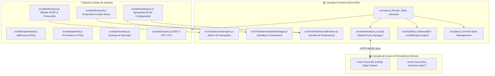
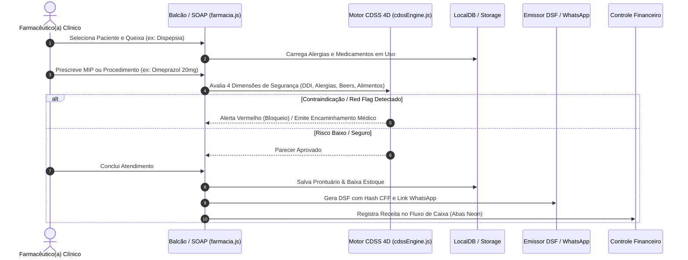
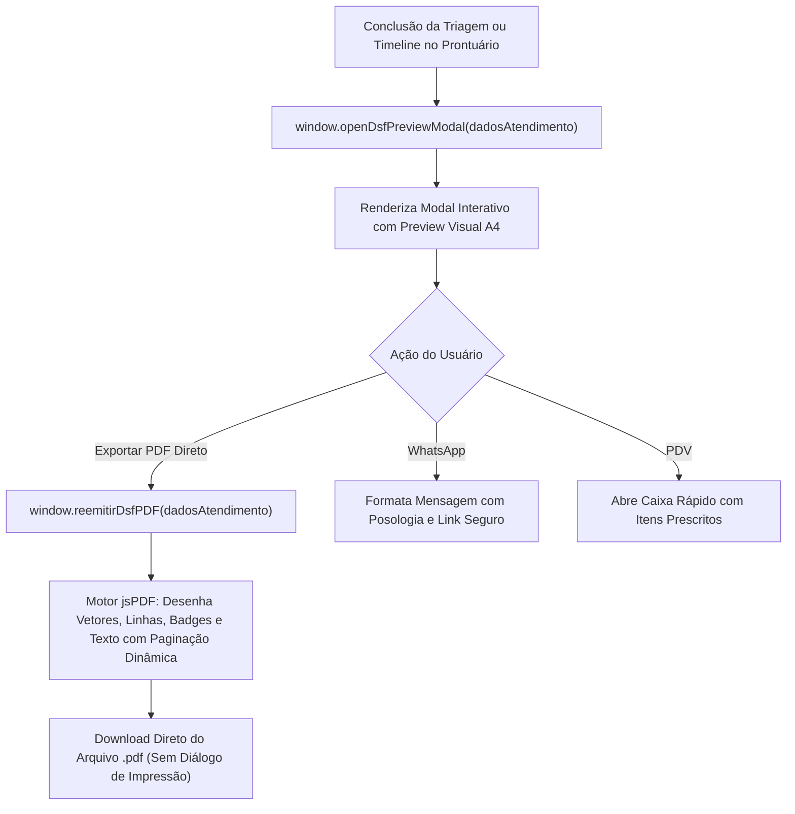
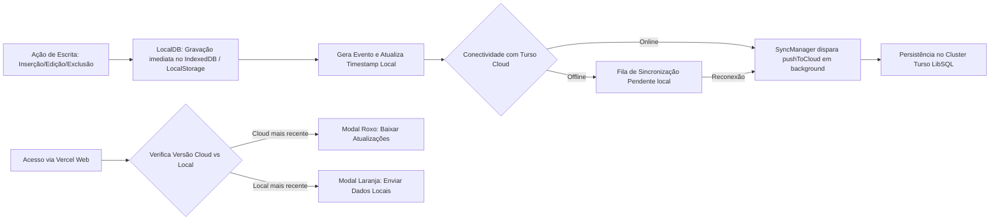

# 💻 CRM Clínico Farmacêutico — Guia Completo do Desenvolvedor & Arquitetura de Software

> **Versão:** 3.1.0  
> **Arquitetura:** SPA Modular Vanilla JavaScript (ES Modules) + Vite 5 + LocalDB (Offline-First) + Turso Cloud (LibSQL Cluster)  
> **Conformidade Regulatória:** CFF nº 585/2013, CFF nº 586/2013, CFF nº 654/2018, ANVISA RDC nº 44/2009 e RDC nº 786/2023  
> **Última Atualização:** Setembro/2026

---

## 📐 1. Organograma da Arquitetura do Sistema

O **CRM Clínico Farmacêutico v3.1** foi construído com arquitetura modular, sem acoplamento a frameworks pesados, garantindo carregamento instantâneo (< 200ms) e operação 100% resiliente em modo Offline-First.



---

## 🔄 2. Fluxograma do Atendimento Clínico Farmacêutico (SOAP & CDSS 4D)



---

## 💎 3. Estrutura dos Módulos Principais

| Módulo | Arquivo Fonte | Responsabilidade |
| :--- | :--- | :--- |
| **Dashboard** | `src/tabs/dashboard.js` | Gráficos de atendimentos, taxa de adesão, intervenções CDSS e faturamento. |
| **Balcão & SOAP** | `src/tabs/farmacia.js` | Triagem guiada (<60s), checagem de Red Flags, prescrição de MIPs e vacinas. |
| **Prontuário** | `src/tabs/patients.js` | Cadastro com validação de CPF, PBMs, alergias estruturadas e Portal PWA. |
| **Estoque** | `src/tabs/inventory.js` | Leitor de código de barras (câmera/USB), lotes, validade, Curva ABC e ajustes. |
| **Financeiro** | `src/tabs/financial.js` | Abas Neon (Todos, Receitas, Despesas), Botões `+` dinâmicos e DRE em tempo real. |
| **Relatórios** | `src/tabs/reports.js` | Emissão de Declaração de Serviço Farmacêutico (DSF) e relatórios executivos. |
| **Configurações** | `src/tabs/settings.js` | Central com 7 Agrupamentos (RBAC, Turso, RT, Backup, Protocolos, Sandbox, Parâmetros). |
| **Parâmetros** | `src/modules/financialParams.js` | CRUD e sincronização bidirecional de categorias de receitas, despesas e pagamentos. |
| **Simulador** | `src/modules/simulationManager.js` | Geradores de dados de teste e rotinas de limpeza/hard reset com senha Master. |
| **Sincronização** | `src/modules/sync.js` | Reconciliação atômica de timestamps, detecção de nuvem e modais Roxo/Laranja. |

---

## 🔒 4. Controle de Acesso e Permissões (RBAC)

O sistema possui 5 perfis pré-configurados:

1. **👑 Master (`mazzarowysk`)**: Acesso irrestrito a todas as abas, gerenciamento de operadores, limpezas de base e parâmetros fiscais/financeiros.
2. **💊 Farmacêutico(a) RT**: Gestão clínica plena, assinatura e emissão de DSF, parametrizações clínicas e dados do estabelecimento.
3. **🩺 Farmacêutico(a) Clínico**: Atendimentos de balcão, prescrição de MIPs, aplicação de injetáveis, consulta a prontuários e estoque.
4. **🛠️ Administrador**: Gestão operacional, relatórios gerenciais, estoque e financeiro.
5. **📋 Atendente de Balcão**: Cadastro de pacientes, agendamentos rápidos e vendas no PDV.

---

## 🧪 5. Simulação de Dados (Sandbox) & Reset Seguro

- **Geradores Modulares**: Criação com 1 clique de clientes fictícios, atendimentos SOAP com posologias, entradas de estoque com lotes e movimentações de fluxo de caixa com a tag identificadora `[SIMULADO]`.
- **Limpeza Seletiva**:
  - `Limpar Simulação`: Remove exclusivamente registros marcados com `[SIMULADO]` (autenticado por senha).
  - `Limpar Cadastros Reais`: Remove dados manuais de produção sem afetar usuários e configurações (autenticado por senha Master + confirmação `"LIMPAR"`).
  - `Hard Reset de Fábrica`: Purga atômica e integral de todos os atendimentos, prontuários, prescrições, vendas PDV e compras de teste, sincronizando o expurgo no IndexedDB e na nuvem Turso Cloud (autenticado por senha Master + confirmação textual `"HARD RESET"`).

---

## 📄 2.3 Pipeline de Emissão & Consulta da DSF (Modal & PDF Vetorial)

O sistema conta com um motor desacoplado para consulta em tela e geração de documentos sanitários regulatórios (CFF 585/586):



### 2.3 Fluxograma da Sincronização Local-First ↔ Cloud Turso (Dual Pipeline)



---

## 📊 3. Estrutura das Coleções de Dados (LocalDB & Turso Cloud)

| Coleção | Descrição dos Dados | Chave Primária |
| :--- | :--- | :--- |
| `patients` | Cadastros completos de pacientes, dados de contato, CPF, PBMs e convênios | `id` (UUID / Timestamp) |
| `clinical_records` | Atendimentos de balcão (SOAP), aferições (PA, Glicemia), queixas e prescrições | `id` |
| `dsf_records` | Declarações de Serviços Farmacêuticos emitidas com Hash e Carimbo CFF | `id` |
| `inventory_items` | Catálogo de produtos, medicamentos, lotes, validades e estoques | `id` |
| `financial_transactions` | Lançamentos de receitas, despesas, faturamento clínico e formas de pagamento | `id` |
| `financial_categories` | Categorias configuráveis de receitas e despesas vinculadas ao botão `+` | `id` |
| `financial_payment_methods` | Formas de pagamento aceitas na farmácia (Dinheiro, PIX, Cartão, PBM, etc.) | `id` |
| `users` | Operadores e profissionais com perfis RBAC e credenciais criptografadas | `id` |
| `system_settings` | Parâmetros da farmácia (CNPJ, Razão Social, Farmacêutico RT, CRF-SP) | `id` |

---

## 🎛️ 4. Sistema de Controle de Acesso (RBAC)

O controle de permissões é gerenciado de forma modular e granular através de `src/modules/auth.js`:

| Perfil | Dashboard | Balcão & Prescrição | Prontuário | Estoque | Financeiro | Relatórios / DSF | Configurações |
| :--- | :---: | :---: | :---: | :---: | :---: | :---: | :---: |
| **👑 Master (`mazzarowysk`)** | ✅ | ✅ | ✅ | ✅ | ✅ | ✅ | ✅ (Total + Reset) |
| **💊 Farmacêutico RT** | ✅ | ✅ | ✅ | ✅ | ✅ | ✅ | ✅ (Clínico & RT) |
| **🩺 Farmacêutico Clínico** | ✅ | ✅ | ✅ | ✅ | ❌ | ✅ | ❌ |
| **🛠️ Administrador** | ✅ | ❌ | ✅ | ✅ | ✅ | ✅ | ❌ |
| **📋 Atendente de Balcão** | ❌ | ✅ (Triagem) | ✅ | ✅ (Consulta) | ❌ | ❌ | ❌ |

---

## 🛠️ 5. Estrutura do Projeto & Código-Fonte

```
CRM Clínico Farmacêutico/
├── src/
│   ├── main.js                  # Entry point SPA, roteador e ciclo de vida
│   ├── state.js                 # Gerenciamento de estado global reativo
│   ├── localDB.js               # Motor Local-First (IndexedDB / LocalStorage)
│   ├── manualTabbed.js          # Manual Interativo em 7 Abas com busca semântica
│   ├── aiCopilot.js             # Copilot Clínico Farmacêutico AI com RAG clínico integrado
│   ├── modules/
│   │   ├── auth.js              # Autenticação, RBAC e sessões
│   │   ├── cdssEngine.js        # Motor 4D de interações e alertas de segurança
│   │   ├── digitalCert.js       # Chancela Digital ICP-Brasil / GOV.BR e Carimbo do Tempo (ACT)
│   │   ├── financialParams.js   # Gestão de categorias financeiras e formas de pagamento
│   │   ├── postCareAutomation.js# Automação de Follow-up D+2 e Alerta de Refill D-5 via WhatsApp
│   │   ├── simulationManager.js # Sandbox de simulação e rotinas de limpeza segura
│   │   ├── sync.js              # Sincronização inteligente com Turso Cloud LibSQL
│   │   ├── thermalReceipt.js    # Impressão térmica ESC/POS (58mm/80mm) para vendas e cupom clínico
│   │   ├── tlrModal.js          # Testes Laboratoriais Remotos (RDC 786/2023) e Laudo em PDF
│   │   └── ui.js                # Modais, Toasts, Confirmações e utilitários visuais
│   └── tabs/
│       ├── dashboard.js         # Gráficos, métricas clínicas e indicadores
│       ├── doctors.js           # Prontuário médico/farmacêutico e Telemetria Gráfica (Chart.js)
│       ├── pharmacy.js          # Balcão SOAP, triagem <60s, MIPs e vacinas
│       ├── patients.js          # Prontuário longitudinal, TLR e Portal do Paciente PWA
│       ├── inventory.js         # Estoque, leitor de código de barras e lotes
│       ├── financial.js         # Controle financeiro, Abas Neon e DRE
│       ├── reports.js           # Declarações DSF e relatórios executivos
│       └── settings.js          # Painel central com dados do estabelecimento e assinatura digital
├── docs/                        # Documentação técnica e arquitetural
├── api/                         # Endpoints Serverless (Vercel)
├── index.html                   # HTML base com fontes Outfit/Inter e FontAwesome
├── vite.config.js               # Configuração do empacotador Vite
└── package.json                 # Manifesto do projeto v3.1.0
```

---

## 🚀 6. Guia de Instalação e Execução

```bash
# 1. Clonar o repositório
git clone https://github.com/Mazzarowysk/crm-clinico-farmaceutic.git
cd crm-clinico-farmaceutic

# 2. Instalar as dependências
npm install

# 3. Executar o ambiente de desenvolvimento local
npm run dev

# 4. Compilar para produção (Vite Bundle)
npm run build
```

---

*Documentação mantida pela Engenharia de Software — CRM Clínico Farmacêutico v3.0 — 2026*
