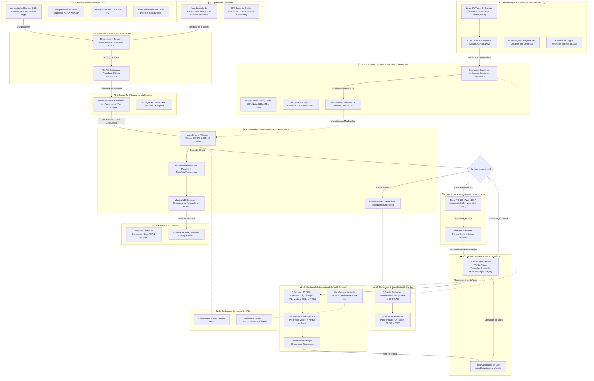

# 📘 Health Nexus — Manual Operacional do Usuário (Completo & Ilustrado)

> **Versão:** 2.7.2 — Agosto/2026  
> **Público-Alvo:** Recepcionistas, Enfermeiros, Médicos, Farmacêuticos, Gestores Financeiros e Administradores Hospitalares  
> **Sistema:** Health Nexus — Gestão Hospitalar & Pronto-Socorro

---

## 🏛️ 1. Organograma da Estrutura Hospitalar & Perfis de Acesso (RBAC)

O **Health Nexus** utiliza Controle de Acesso Baseado em Perfis (RBAC — Role-Based Access Control) para garantir a segurança dos dados clínicos e sigilo financeiro.

```
                    ┌─────────────────────────────────────────┐
                    │      👑 MASTER / ADMINISTRADOR           │
                    │   Gestão Total · Aprovação · Auditoria  │
                    └────────────────────┬────────────────────┘
                                         │
        ┌───────────────────┬────────────┴───────┬───────────────────┐
        │                   │                    │                   │
┌───────┴──────┐   ┌────────┴───────┐   ┌────────┴──────┐   ┌────────┴──────┐
│ 💻 DESENVOLV.│   │ 🩺 MÉDICO /    │   │ 🩺 ENFERMAGEM │   │ 📋 RECEPÇÃO   │
│ Acesso Total │   │  CORPO CLÍNICO │   │ Triagem/Obs/  │   │ Admissão/TV/  │
│  + Sync DB   │   │ PEP & Planilha │   │ Leitos/Meds   │   │ Caixa Entrada │
└──────────────┘   └────────────────┘   └───────────────┘   └───────────────┘
                                                 │
                                        ┌────────┴──────┐
                                        │ 💊 FARMÁCIA / │
                                        │  ESTOQUE      │
                                        └───────────────┘
```

### Matriz Geral de Permissões RBAC

| Perfil | Acesso Visual às Abas | Prontuário (PEP) | Triagem Manchester | Prescrição Planilha | Gestão de Leitos | Financeiro | Lixeira / Sync |
|---|---|---|---|---|---|---|---|
| **👑 Master / Admin** | Todas as abas | Total | Total | Total | Total | Total | Exclusivo |
| **🩺 Médico** | Dashboard, Pacientes, Atendimento, Leitos, Farmácia, Relatórios | Assinatura SOAPE | Consulta | Criação de Planilha | Solicitação | Bloqueado | Bloqueado |
| **🩺 Enfermeiro(a)** | Dashboard, Pacientes, Atendimento, Leitos, Farmácia | Leitura | Execução Manchester | Checagem de Doses | Gestão / Transferência | Bloqueado | Bloqueado |
| **📋 Recepcionista** | Dashboard, Pacientes, Agenda, Atendimento, Painel TV, Caixa | Bloqueado | Bloqueado | Bloqueado | Bloqueado | Apenas Entradas | Bloqueado |
| **💊 Farmacêutico(a)**| Dashboard, Pacientes, Farmácia, Relatórios | Bloqueado | Bloqueado | Bloqueado | Bloqueado | Bloqueado | Bloqueado |

### ☁️ Sincronização em Nuvem de Alta Disponibilidade (Dual-Pipeline) & Dashboard Dinâmico (v2.7.2)

O sistema conta com arquitetura de sincronização resiliente multi-usuário e painel 100% dinâmico:
1. **Dual-Pipeline (Proxy + Fallback HTTP Direto):** O cliente tenta o envio através do proxy `/api/turso` e, caso ocorra qualquer instabilidade de rota, aciona automaticamente o pipeline HTTP nativo do Turso Cloud (`v2/pipeline`), garantindo 99.9% de disponibilidade.
2. **Dashboard Dinâmico e Reativo:** Todos os gráficos do painel inicial (*Ocupação de Leitos por Ala*, *Funil de Atendimento*, *Risco Manchester* e *Histórico de Atendimentos*) recalculam instantaneamente com base nos dados reais ou simulados do `localDB` e da nuvem.
3. **Navegação Assistida & Retorno Rápido (`Alt + M`):** Ao navegar pelo Manual ou Copilot, o *Floating Return Beacon* mantém o link direto de volta ao ponto de pesquisa com destaque pulsante.
4. **Validação Atômica:** O sistema só confirma o envio após o cluster Turso devolver confirmação com hash/timestamp positivo.
5. **Bloqueio de Tela nos Processos Críticos:** Nas ações de "Limpar Banco" e "Gerar Simulação", a tela permanece em estado de carregamento seguro até a confirmação total da nuvem, eliminando perda de dados por recarregamento precoce.
6. **Contagem de Registros:** Cada sincronização informa no toast e no console a quantidade precisa de pacientes, atendimentos e agendamentos gravados ou baixados.

### 🤖 Assistente de IA Local & Busca Semântica Multi-Tier (v2.7.0)

O sistema possui um **Motor de Busca Semântica Multi-Tier e Copilot IA Integrado** acessível tanto pelo cabeçalho global (`Ctrl + K`) quanto no Manual Interativo por Abas:

1. **Dicionário de Sinônimos Clínicos & Operacionais:** Reconhece equivalências como `colaborador` ➔ `médico / corpo clínico`, `excluir` ➔ `exclusão / inativação`, `remédio` ➔ `medicamento`, `consulta` ➔ `agendamento`, etc.
2. **Desambiguação Inteligente de Ações:** Ao pesquisar termos genéricos como "excluir", a IA categoriza e sugere caminhos diretos para exclusão de pacientes, médicos, leitos, medicamentos, títulos e agendamentos.
3. **Segurança RBAC na IA:** A IA tem plena consciência do perfil logado e avisa se a funcionalidade consultada exige permissões de outro papel.

### 📌 Navegação Assistida & Floating Return Beacon (`Alt + M`)

Ao consultar qualquer funcionalidade no manual e clicar no botão **`🚀 Ir para a Tela & Praticar (Navegar)`**:
- O sistema navega para a aba correta e abre o modal/formulário necessário.
- Um **Beacon Flutuante** de retorno é fixado no canto inferior direito.
- Clicar no beacon ou teclar **`Alt + M`** devolve o usuário exatamente ao tópico consultado no manual, aplicando um **efeito de brilho pulsante (*Smart Highlight Pulse*)** no card correspondente.

---

## 🔄 2. Fluxograma Geral Integrado de Todas as Abas e Correlações (v2.4.0)

O fluxograma abaixo mapeia a correlação completa entre todas as 12 abas do sistema, destacando os diferenciais operacionais e particularidades de cada módulo:



### 🌟 Particularidades e Diferenciais das Abas do Health Nexus

| # | Aba / Módulo | Funcionalidades Principais | Diferencial & Particularidades |
|---|---|---|---|
| **1** | **🔒 Autenticação & RBAC** | Login JWT, 24 contas clínicas/devs, perfis de acesso | Preservação de usuários em limpezas, lixeira com confirmação, auditoria de acessos (5/100). |
| **2** | **📊 Dashboard Executivo** | KPIs em tempo real, receita, volume de atendimentos | Gráficos Chart.js clicáveis como botões de filtro ativo que direcionam para as abas. |
| **3** | **🗓️ Agenda de Consultas** | Marcação de consultas, seleção de médico e sala | KPI cards clicáveis por status (Confirmado, Atendimento, Concluído). |
| **4** | **👥 Pacientes (SUS)** | Admissão 11 campos SUS, CEP automático ViaCEP | Validação rigorosa de responsável legal (<18/>65), busca por Nome/CPF, Lixeira soft-delete. |
| **5** | **🚨 Atendimentos & Triagem** | Fila visual Kanban, classificação de risco Manchester | Sorting de prioridade por cor de risco automático + chamada no Painel TV. |
| **6** | **📺 Painel TV (Chamador)** | Anúncio para sala de espera em tela cheia | **Web Speech API**: chamada em viva voz sintetizada em português. |
| **7** | **🩺 Prontuário PEP (SOAPE)** | Atendimento médico, CID-10, prescrições e evoluções | Busca CID-10 offline, prescrição em planilha, Matriz da Enfermagem para checagem, PDF A4. |
| **8** | **⏱️ Alertas & Estagnação** | Monitoramento de gargalos e permanência PS | Timer PS 12h (Azul <10h / Amarelo 10-12h / Vermelho >12h pulsante). |
| **9** | **🛏️ Censo de Leitos** | Mapa visual de leitos hospitalares | Cards tricolores (Verde=Vago, Vermelho=Ocupado, Amarelo=Higienização automática pós-alta). |
| **10** | **📊 Kanban de Internação** | Gestão de internados por 5 setores | Metas de permanência (SLA) dinâmicas, timeline de evolução clínica, auditoria de atrasos. |
| **11** | **🩺 Escalas de Trabalho** | Gestão de plantões de Médicos e Enfermeiros | Orelhas/sub-abas dedicadas, turnos (6h, 12h, 24h, 12x36), garantia de plantão ativado para HOJE. |
| **12** | **💊 Farmácia & Estoque** | Controle de estoque de medicamentos e insumos | Pesquisa global de fármacos em tempo real via OpenFDA / ANVISA por princípio ativo. |
| **13** | **📈 Relatórios & Exportação**| 5 cards especializados de emissão relatorial | Exportação multiformato (**PDF**, **Excel XLSX**, **CSV**) para Finanças, Atendimentos, PEP, Leitos e Escalas. |


---

## 📋 3. Admissão SUS com Validação de Responsável Legal

Na aba **Pacientes**, a Recepção realiza a admissão cadastral com **11 Campos SUS**.

### Tabela de Campos e Regras de Segurança

| Campo | Preenchimento | Regra de Validação do Sistema |
|---|---|---|
| **Nome Completo** | Nome oficial | Trava contra nomes duplicados (409 Conflict) |
| **CPF** | 11 dígitos | Validação matemática de CPF real + trava contra duplicidades |
| **Data de Nascimento** | DD/MM/AAAA | Calcula a **Idade** automaticamente em tempo real |
| **Cartão SUS** | 15 dígitos | Validação de formato SUS |
| **Telefone / Celular** | DDD + Número | Aplicação de máscara automática |
| **CEP (ViaCEP)** | 8 dígitos | Consulta automática e preenchimento de Rua, Bairro e Cidade |
| **Responsável Legal** | Obrigatório se < 18 ou > 65 anos | Exige **Nome, CPF, Telefone e Parentesco** do responsável legal |

---

## 🚦 4. Triagem Manchester & Fila de Espera por Gravidade

A Enfermagem classifica os pacientes em 5 níveis de gravidade.

```mermaid
gantt
    title Prazos Limite do Protocolo de Manchester
    dateFormat  X
    axisFormat %s min

    section Emergência
    Atendimento Imediato (0 min) : active, 0, 1
    section Muito Urgente
    Atendimento em até 10 min    : critical, 0, 10
    section Urgente
    Atendimento em até 60 min    : 0, 60
    section Pouco Urgente
    Atendimento em até 120 min   : 0, 120
    section Não Urgente
    Atendimento em até 240 min   : 0, 240
```



---

## 💊 5. Prescrição em Planilha & Matriz da Enfermagem

O médico monta a prescrição em formato de tabela. A equipe de enfermagem visualiza a matriz de horários e clica em **"Checar/Administrar"** para gravar o profissional e o horário exato da aplicação.

### Vias de Administração & Frequências Suportadas

| Via de Administração | Frequência Padrão | Descrição Operacional |
|---|---|---|
| **VO** (Via Oral) | `6/6h`, `8/8h`, `12/12h` | Comprimidos, xaropes e gotas |
| **EV / IV** (Endovenosa) | `Contínua`, `12/12h`, `8/8h` | Injeções e soros em veia |
| **IM** (Intramuscular) | `Dose Única`, `24/24h` | Injeções em músculo |
| **SC** (Subcutânea) | `12/12h`, `1x/dia` | Insulinas e anticoagulantes |
| **Tópica / Inalatória** | `Se dor`, `8/8h` | Pomadas, nebulizações |

---

## ⏱️ 6. Timer de Observação PS (12h) & Transferência de Leitos

O sistema monitora a permanência do paciente em observação no Pronto-Socorro:

- **🟢/🔵 < 10 Horas:** Estágio normal de observação (`⏱️ Obs PS: Xh Ym / 12h max`).
- **🟡 10h a 12h:** Alerta de aproximação do limite legal (`⚠️ Atenção: Xh Ym`).
- **🔴 > 12 Horas:** Alerta crítico pulsante (`🚨 EXCEDEU 12H PS: TRANSFERIR`).

### Passo a Passo para Subir para Internação:
1. Clique no botão **"🛌 Subir para Internação"** no card do paciente.
2. Selecione um **Leito Vago** na gaveta lateral (UTI, Enfermaria, Pediatria).
3. Confirme a transferência. O atendimento muda para `Internado` e o leito vira `Ocupado`.

---

## 📊 7. Kanban de Internação — Grade Síncrona & 5 Setores

O **Kanban de Internação** organiza visualmente os pacientes hospitalizados em 5 setores estratégicos com metas de permanência (SLA) individuais:

| # | Setor | Cor | Meta de Permanência |
|---|---|---|---|
| 1 | 🔵 **Pronto Socorro (Obs)** | Azul Índigo | 24 horas |
| 2 | 🟠 **Corredor de Internação** | Âmbar | 1 dia |
| 3 | 🟣 **Clínica Cirúrgica** | Roxo | 7 dias |
| 4 | 🟢 **Clínica Médica (SUS)** | Verde | 10 dias |
| 5 | 🔴 **UTI** | Vermelho | 5 dias |

### 📐 Seletores de Setor (Visão Geral)
Os 6 cards superiores funcionam como filtros interativos: **"Visão Geral"** exibe todos os setores lado a lado; clicar em um setor específico expande aquela coluna em grid de múltiplos cartões (largura total).

### 🎨 Design dos Cards de Paciente
Cada card exibe:
- **Avatar com iniciais** do paciente (cor do setor)
- **Nome, Diagnóstico, Leito e Médico responsável**
- **Barra de progresso SLA** colorida dinamicamente (verde → âmbar → rosê)
- **Botões de ação:** Prontuário, Evolução, Editar, Mover Setor, Alta
- **Borda superior colorida** indicando status do SLA de relance

### 📊 Cards Analíticos do Topo
- **Distribuição por Setor:** Clique nas fatias do gráfico Donut para filtrar o Kanban instantaneamente. Clique no número central para o **Modal de Detalhamento por Setor** (lista pacientes por ala e leito).
- **Metas de Tempo (SLA):** Clique nas fatias verde/âmbar/vermelho para filtrar pacientes por status de SLA. Clique no percentual central para o **Modal de Auditoria de SLAs** (lista completa com botão "Prontuário" e filtro "Filtrar Atrasados").
- **Funil da Jornada Hospitalar:** Barras horizontais mostrando a distribuição de pacientes por setor em percentual.

---

## 🛏️ 8. Gestão de Leitos — Mapa Interativo

O **Mapa de Leitos** apresenta todos os leitos da instituição em grid de cards visuais.

### Status dos Leitos

| Status | Cor da Borda Superior | Descrição |
|---|---|---|
| **Vago** | 🟢 Verde | Leito disponível para internação |
| **Ocupado** | 🔴 Rosê/Vinho | Leito com paciente internado |
| **Higienização** | 🟡 Âmbar | Leito em processo de limpeza pós-alta |

### Ações por Leito
- **Leito Vago:** Botão **"Internar Neste Leito"** (azul índigo) — abre seleção de paciente.
- **Leito Ocupado:** Botão **"Alta Hospitalar"** (vinho/rosê suavizado) — abre modal de confirmação e automaticamente envia o leito para higienização.
- **Em Higienização:** Botão **"Liberar Leito"** (verde) — retorna o leito ao status vago.

### Modal de Confirmação de Alta
O modal "Confirmar Alta" apresenta:
- Acento colorido no topo (gradiente rosê)
- Ícone representativo da ação
- Mensagem de confirmação
- Badge informativo: *"O leito será marcado como Em Higienização automaticamente"*
- Botões com espaçamento confortável: **Cancelar** (neutro) e **Sim, Confirmar** (rosê vinho)

---

## 📄 9. Prontuário Eletrônico (PEP) — PDF Real & Anexo de Exames

Na janela do Prontuário do Paciente, o profissional conta com duas ações principais:

- **📄 Gerar PDF:** Compila automaticamente todo o histórico assistencial (Internações, Evoluções, Urgência/PS, Consultas e Anotações) e gera o download direto de um relatório PDF oficial A4 (jsPDF + autoTable).
- **📎 Anexar Exame:** Permite selecionar qualquer arquivo de laudo ou imagem do computador. O sistema registra no histórico com data, hora, nome e tamanho do anexo.

---

## 💳 10. Gestão Financeira & Baixa Manual de Parcela

No módulo de **Relatórios / Financeiro**:
- A Recepcionista ou Administrador visualiza a lista de faturas e títulos em aberto.
- Clique no botão **Dar Baixa Manual** para quitar uma parcela individual preenchendo o valor pago, forma de pagamento (Pix, Cartão, Dinheiro) e observações.
- É possível selecionar múltiplas parcelas e realizar **Baixa Manual em Lote**.

---

## ⏱️ 11. Notificações de Fluxo & Cronômetro de Sincronização de 15 Minutos

### Notificações de Fluxo com Botão de Direcionamento Persistente
Toda ação executada sobre um paciente (chamar para consultório, salvar triagem, iniciar observação 12h no PS, internar em leito ou finalizar atendimento) gera um aviso fixo no topo direito da tela com:
- **Status & Setor de Destino Explicito**: Ex: `📢 Marcelo Mazaro Chamado para o Consultório 01 (Coluna Em Atendimento)`.
- **Navegação em 1 Clique**: Botão **`Ir para a Aba [Nome da Aba] ➔`** que conduz o usuário diretamente para a aba e coluna onde o paciente se encontra.
- **Persistência**: O aviso permanece visível na tela até que o usuário clique para navegar ou feche no botão de confirmação.

### Cronômetro de Auto-Sync de 15 Minutos
- No cabeçalho superior do sistema, o badge de sincronização exibe a contagem regressiva de **15 minutos** (ex: `⏱️ 14:59`, `14:58`...).
- Ao término dos 15 minutos (`00:00`), o sistema faz a comparação automática dos dados locais com o Turso Cloud DB:
  - **Se houver alterações pendentes**: Abre o modal solicitando autorização para envio (`Sim, Enviar para a Nuvem` ou `Lembrar em 15 min`).
  - **Se não houver alterações**: O temporizador é reiniciado em silêncio sem abrir pop-ups incômodos.

---

## 🌗 12. Modo Claro & Modo Escuro

O sistema suporta dois temas visuais que podem ser alternados pelo botão ☀️/🌙 no canto superior direito:

- **Modo Escuro (padrão):** Fundo azul escuro (`#0f172a`), cards em vidro translúcido escuro, ideal para ambientes com pouca luz.
- **Modo Claro:** Fundo cinza slate suave (`#e2e8f0`), cards em vidro translúcido claro, ideal para ambientes iluminados.

> **Importante:** Todos os modais, janelas e componentes respeitam automaticamente o tema ativo — não há mais divergência de cores entre modais e o restante da interface.

---

## 🛠️ 12. Guia de Solução de Problemas & Dúvidas Frequentes (FAQ)

| Problema | Causa Provável | Solução Recomendada |
|---|---|---|
| **Como emitir PDF do prontuário?** | Impressão ou download de histórico | Clique em **Prontuário** no card do paciente e selecione **📄 Gerar PDF**. |
| **TV sem som na chamada de paciente** | Permissão de áudio silenciada no Chrome | Clique em qualquer área da tela da TV para ativar a Web Speech API. |
| **Sincronização Turso com aviso vermelho** | Falha de internet ou token pendente | Vá em **Configurações → Turso**, clique em **Testar Conexão** e em seguida **Sincronizar Agora**. |
| **Modal aparece escuro no modo claro** | Componente com rgba hardcoded | Verificar se o componente usa variáveis CSS de tema (`var(--bg-secondary)`). |
| **Botão Prontuário não funciona no modal SLA** | Atributo onclick malformado | Atualizar o sistema para a versão 2.3.0+ que corrige este bug. |
| **Erro de CPF duplicado na admissão** | Paciente já cadastrado anteriormente | Use a busca de pacientes para re-admitir sem criar duplicidade. |
| **Cards do Kanban sem destaque de cor** | Cache do navegador | Pressione `Ctrl+Shift+R` para recarregar o sistema sem cache. |

---

## ⏰ 13. Módulo de Escalas de Trabalho (Médicos e Enfermeiros)

O módulo de **Escalas de Trabalho & Plantões** (aba <i class="fa-solid fa-user-clock"></i>) permite a gestão operacional completa da equipe hospitalar:

### 13.1. Navegação por Orelhas
- **🩺 Escala de Médicos:** Visualização dos plantões por médico, CRM, especialidade, turno (Manhã, Tarde, Noite, Plantão 24h), consultório/setor e horas de carga horária.
- **💉 Escala de Enfermeiros:** Visualização dos plantões por enfermeiro, COREN, setor/função (Triagem Manchester, Enfermaria Geral, UTI Adulto, Medicação, Centro Cirúrgico) e turnos (6h, 12h, Escala 12x36).

### 13.2. Controle de Contas e Logins por Perfil
- Cada Médico e Enfermeiro possui login de acesso cadastrado (ex: `dr.carloseduard`, `silviacwb`).
- Ao logar com perfil Médico ou Enfermeiro, o profissional tem acesso às abas assistenciais e escalas, mantendo **bloqueado** o acesso a configurações avançadas de sistema e gestão de usuários.

### 13.3. Filtros, Cadastro de Plantão e Impressão
- **Filtros:** Busca rápida por nome/registro/setor, filtro por período (Hoje, Esta Semana, Este Mês, Todos) e filtro por turno.
- **Cadastrar Plantão:** Botão **"+ Novo Plantão"** para alocação direta de profissionais.
- **Impressão:** Botão **"Imprimir Escala"** gera relatório formatado para fixação física nos setores.

---

## 🔍 15. Busca Global no Topo (`Ctrl + K`) & Manual Interativo por Abas

O Health Nexus conta com um motor de inteligência e busca instantânea síncrona no cabeçalho da aplicação (`app-header`):

### 15.1. Barra de Busca Global Spotlight (`Ctrl + K`)
- **Atalho do Teclado:** Pressione `Ctrl + K` (ou `Cmd + K` no Mac) em qualquer lugar do sistema para focar a barra de busca instantaneamente.
- **Normalização Inteligente NFD:** Ignore acentos e maiúsculas/minúsculas. Digitar `excluir usuario`, `atestado`, `cid10` ou `turso` encontra exatamente o recurso desejado.
- **Categorias de Resultados:**
  1. **⚙️ Funcionalidades & Ações Relevantes:** Redireciona diretamente para a tela e abre o card/modal da ação (ex: *Controle de Perfis RBAC*, *Excluir Usuário (Lixeira)*, *Nova Prescrição*, *Triagem Manchester*).
  2. **📌 Módulos & Abas:** Navega instantaneamente para qualquer uma das 12 abas do sistema.
  3. **👤 Pacientes Cadastrados:** Busca por nome ou dígitos do CPF e abre o prontuário.
  4. **❓ Dúvidas Operacionais & Respostas (FAQ):** Responde dúvidas frequentes diretamente no menu suspenso ou abre o manual no módulo correspondente.

### 15.2. Manual do Usuário Interativo por Abas (`📖 Manual do Usuário`)
Acessível pelo botão no topo do sistema:
- **9 Módulos Sincronizados com a Sidebar:**
  1. 🏥 Geral & Visão Geral (expandido por padrão)
  2. 📅 Agenda & Consultas
  3. 👥 Recepção & Pacientes
  4. 🩺 Prontuário & Atendimento
  5. 📺 Painel TV & Sala de Espera
  6. 🛏️ Gestão de Leitos & Internação
  7. 💊 Farmácia & Estoque
  8. 📊 Relatórios & Estagnação
  9. ⚙️ Configurações & Turso DB (recolhido por padrão com botão de expansão)
- **Navegação por Setas:** Botões `Anterior` e `Próximo` com desabilitação automática nos limites (1ª e última aba).
### 15.3. Notificações Visuais de Sequência de Fluxo Aprimoradas & Rolagem Suave
O sistema inclui um assistente visual de direcionamento de fluxo em tempo real:
- **Badge de Sequência:** Exibe `📍 SEQUÊNCIA DO FLUXO • PRÓXIMO PASSO` indicando a próxima etapa assistencial (ex: chamada de consultório, triagem manchester, observação 12h, internação).
- **Botão Esmeralda "IR PARA A ABA ➔":** Ao clicar, o sistema navega para a aba de destino e realiza uma **rolagem suave (`scrollIntoView`)** até a coluna do paciente (ex: *Coluna Em Atendimento*).
- **Destaque Luminoso Pulsante (`Glow Animation`):** A coluna alvo pisca por 3 segundos com uma moldura verde brilhante (`0 0 45px #10b981`), permitindo a localização visual instantânea pelo operador.

### 15.4. Cronômetro de Sincronização de 15 Minutos (Header Badge)
- **Status ao Vivo:** O badge no topo superior exibe a contagem regressiva ao vivo: `🟢 Sincronizado • 14:59`.
- **Verificação Automática:** A cada 15 minutos (`00:00`), o sistema faz a comparação silenciosa com o Turso Cloud.
- **Operação Não Interruptiva:** Não são exibidos modais de sincronização durante ações individuais. O modal só é exibido ao atingir os 15 minutos caso existam dados locais pendentes de envio.

---

*Manual operacional produzido e homologado pela equipe Health Nexus (v2.6.0) — Agosto/2026.*


