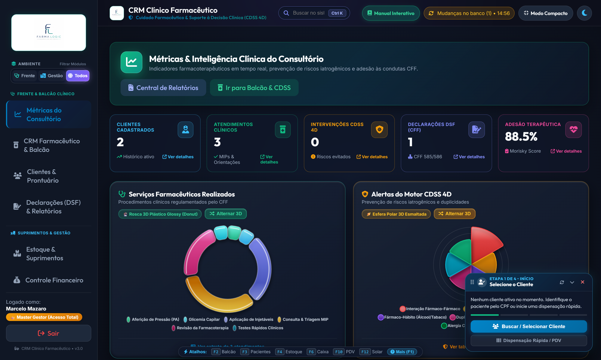
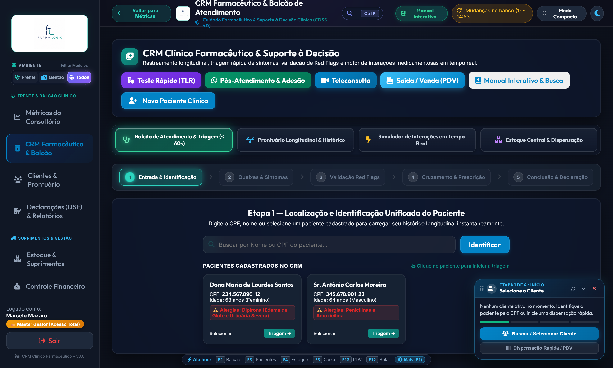
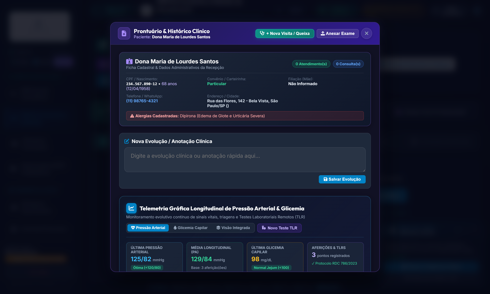
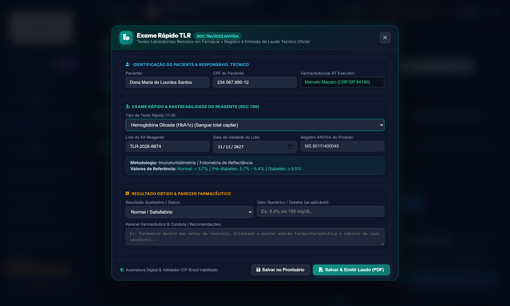
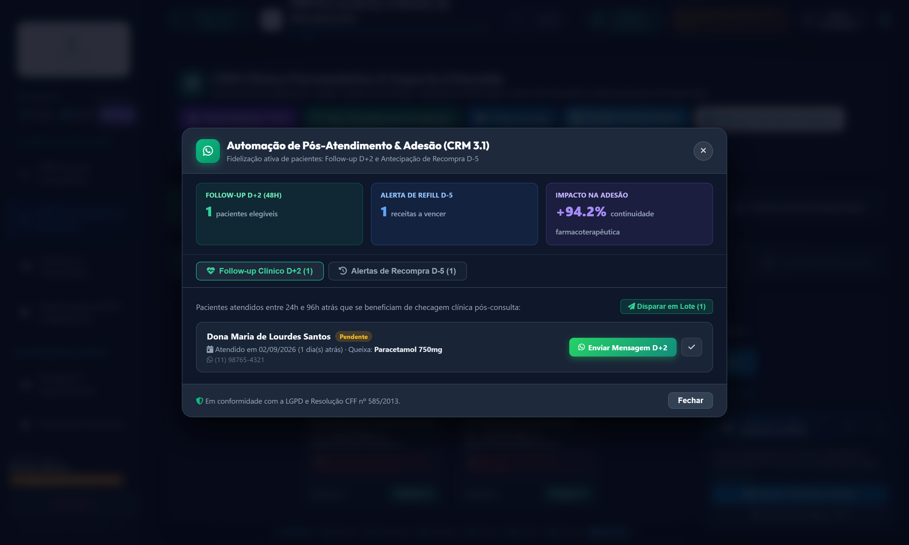
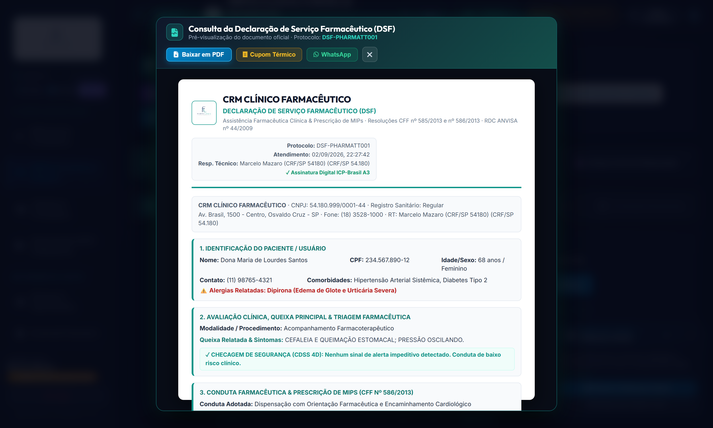
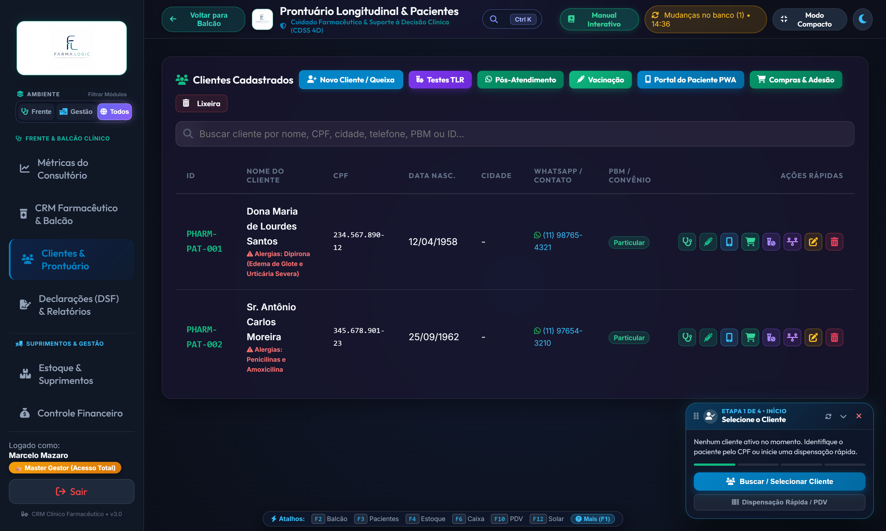
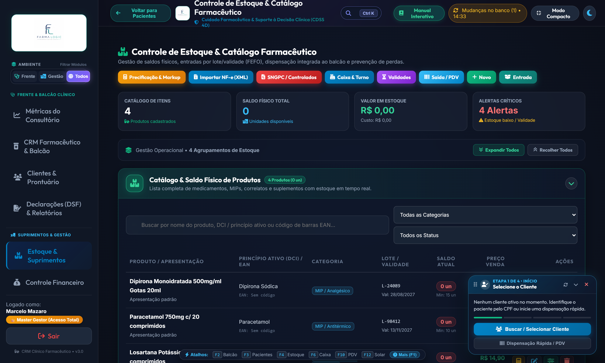
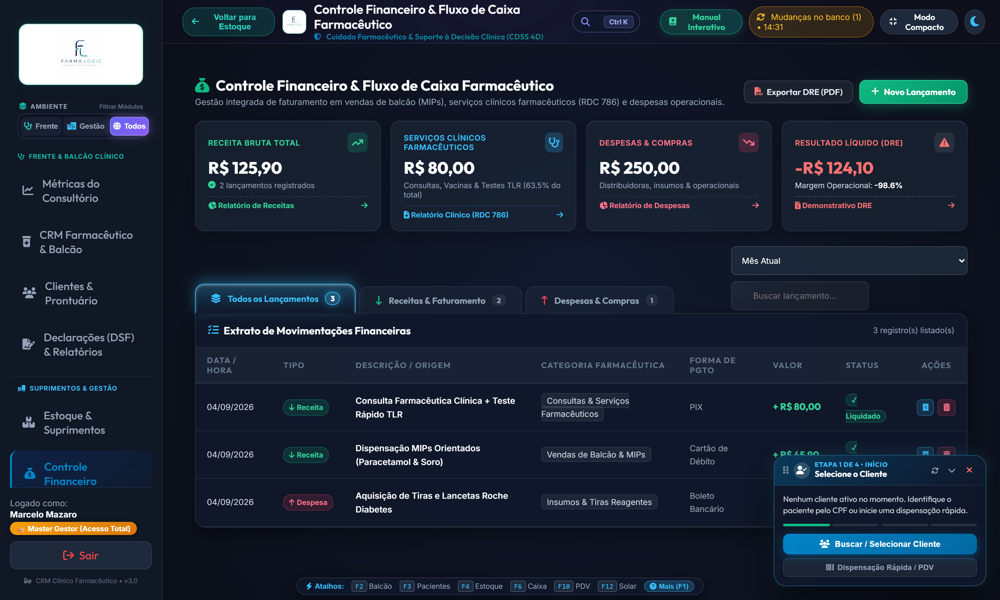
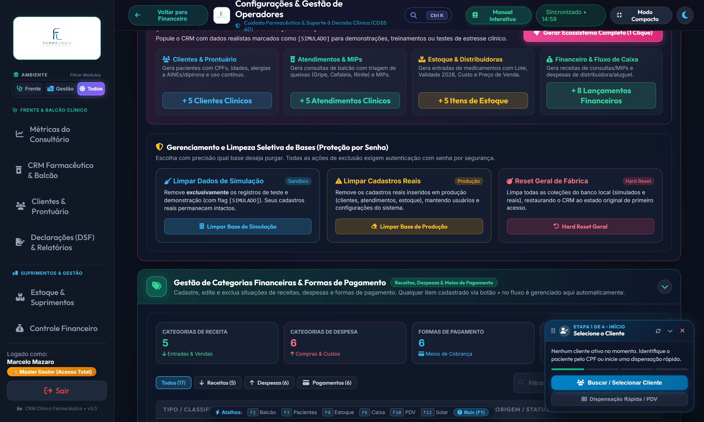

# 📘 CRM Clínico Farmacêutico — Guia Operacional Master Oficial

> **Versão da Plataforma:** 3.1.0 Enterprise Edition  
> **Responsabilidade Técnica:** Dr. Marcelo Mazaro (CRF-SP 54180)  
> **Homologação:** Setembro/2026  
> **Marco Regulatório:** Resoluções CFF nº 585/2013 e 586/2013 | RDC ANVISA nº 786/2023 & 44/2009 | ICP-Brasil MP 2.200-2/2001 | LGPD Lei nº 13.709/2018  
> **Manual Oficial em PDF:** [Baixar Manual Completo Ilustrado (21 Páginas A4)](../../Manual_do_Usuario_CRM_Clinico_Farmaceutico.pdf)

---

## 📑 SUMÁRIO GERAL DO GUIA MESTRE

1. [Visão Geral, Arquitetura Híbrida & Primeiro Acesso](#1-visão-geral-arquitetura-híbrida--primeiro-acesso)
2. [Mapa Completo de Teclas de Atalho (F1 a F12 + Ctrl+K)](#2-mapa-completo-de-teclas-de-atalho-f1-a-f12--ctrlk)
3. [Módulo 1: Dashboard Executivo & Inteligência Clínica](#3-módulo-1-dashboard-executivo--inteligência-clínica)
4. [Módulo 2: Balcão de Atendimento, SOAP & CDSS 4D](#4-módulo-2-balcão-de-atendimento-soap--cdss-4d)
5. [Módulo 3: Prontuário Longitudinal & Telemetria de Sinais Vitais](#5-módulo-3-prontuário-longitudinal--telemetria-de-sinais-vitais)
6. [Módulo 4: Testes Laboratoriais Remotos (TLR - RDC 786/2023) & Laudo](#6-módulo-4-testes-laboratoriais-remotos-tlr---rdc-7862023--laudo)
7. [Módulo 5: Automação de Pós-Atendimento & Adesão (WhatsApp D+2 / Refill D-5)](#7-módulo-5-automação-de-pós-atendimento--adesão-whatsapp-d2--refill-d-5)
8. [Módulo 6: Declaração de Serviço Farmacêutico (DSF), PDF & Cupom Térmico](#8-módulo-6-declaração-de-serviço-farmacêutico-dsf-pdf--cupom-térmico)
9. [Módulo 7: Gestão de Clientes, Portal do Paciente PWA & Motor NLP](#9-módulo-7-gestão-de-clientes-portal-do-paciente-pwa--motor-nlp)
10. [Módulo 8: Estoque & Insumos Clínicos (Rastreabilidade FEFO)](#10-módulo-8-estoque--insumos-clínicos-rastreabilidade-fefo)
11. [Módulo 9: Controle Financeiro, Fluxo de Caixa & DRE](#11-módulo-9-controle-financeiro-fluxo-de-caixa--dre)
12. [Módulo 10: Governança, RBAC & Hard Reset Atômico Seguro](#12-módulo-10-governança-rbac--hard-reset-atômico-seguro)
13. [Checklist Diário do Farmacêutico RT & Plano de Contingência](#13-checklist-diário-do-farmacêutico-rt--plano-de-contingência)
14. [Referências Normativas Oficiais](#14-referências-normativas-oficiais)

---

## 1. Visão Geral, Arquitetura Híbrida & Primeiro Acesso

O **CRM Clínico Farmacêutico** foi concebido para dotar consultórios farmacêuticos, redes e farmácias independentes de uma infraestrutura clínica de alta fidelidade diagnóstica, segurança jurídica irrestrita e monetização sustentável dos serviços de saúde.

### 1.1. Arquitetura Híbrida Offline-First (LibSQL + IndexedDB + Turso Cloud)
- O sistema opera diretamente no navegador com persistência atômica local via **IndexedDB/LibSQL WASM**.
- Em momentos de instabilidade ou perda total de conexão com a internet, o consultório **não para**: triagens, anamneses, consultas de prontuário, aferições de sinais vitais, testes TLR e emissões de declarações de serviço continuam funcionando normalmente.
- Assim que o link com a internet é restabelecido, os registros locais são sincronizados em segundo plano com o banco de dados centralizado em nuvem (**Turso LibSQL Cloud**), garantindo replicação instantânea entre múltiplos terminais da farmácia.

---

## 2. Mapa Completo de Teclas de Atalho (F1 a F12 + Ctrl+K)

Para máxima ergonomia no consultório e balcão, dispensando o uso compulsório do mouse:

| Tecla / Atalho | Módulo / Operação | Finalidade Prática no Consultório |
| :--- | :--- | :--- |
| **`Ctrl + K`** | **Busca Global Rápida** | Abre a paleta de comando instantânea para localizar pacientes, medicamentos ou serviços |
| **`F1`** | **Ajuda & Central de Atalhos** | Exibe o modal central com o mapa completo de operações e dicas clínicas |
| **`F2`** | **Balcão de Atendimento Clínico** | Direciona para o funil SOAP de acolhimento e prescrição farmacêutica |
| **`F3`** | **Clientes & Prontuários** | Abre a base de dados de pacientes, alertas de alergias e histórico clínico |
| **`F4`** | **Estoque & Catálogo FEFO** | Abre a gestão de lotes, validades, insumos e importação de XML de NF-e |
| **`F6`** | **Financeiro & Fluxo de Caixa** | Exibe o faturamento de consultas, despesas, extrato e emissão de DRE |
| **`F7`** | **Central de Relatórios Executivos** | Abre os gráficos 3D dinâmicos, relatórios gerenciais e exportação de PDF |
| **`F8`** | **Dashboard Clínico** | Retorna ao cockpit geral com telemetria, metas e esferas de decisão clínica |
| **`F9`** | **Configurações & Governança** | Gestão de operadores (RBAC), dados da farmácia, Turso Cloud e Hard Reset |
| **`F10`** | **PDV / Caixa Rápido** | Abre o terminal de faturamento com baixa imediata de estoque e PIX BACEN |
| **`F11`** | **Modo Tela Cheia (Imersivo)** | Oculta barras do navegador para atendimento focado no paciente |
| **`F12`** | **Console / Diagnóstico** | Ferramentas técnicas de auditoria de dados e telemetria do sistema |

---

## 3. Módulo 1: Dashboard Executivo & Inteligência Clínica

O **Dashboard Executivo** sintetiza a saúde operacional, financeira e clínica do consultório farmacêutico em tempo real.

### 3.1. Indicadores de Desempenho (KPIs Centrais)
- **Consultas Realizadas no Mês:** Total de atendimentos concluídos com evolução percentual comparativa.
- **Faturamento dos Serviços Clínicos:** Receita bruta dissociada de medicamentos, mensurando o valor real da assistência.
- **Aferições de Sinais Vitais & Testes Rápidos:** Volume de procedimentos de rastreamento em saúde.
- **Taxa de Adesão Terapêutica:** Percentual de pacientes crônicos que mantêm o tratamento sem abandono.

### 3.2. Gráficos 3D Dinâmicos com Alternador de Estilo (`🔄 Estilo`)
- Permite alternar entre **Rosca 3D Glossy**, **Barras 3D Volumétricas**, **Pizza 3D Cristalina**, **Esfera Polar CDSS 3D** e **Linha Suave Neon**.
- O gráfico **Esfera Polar CDSS** distribui o peso dos alertas clínicos (Sepse, Interações Medicamentosas, Alergias, Idosos e Red Flags), orientando a priorização do dia.

---

## 4. Módulo 2: Balcão de Atendimento, SOAP & CDSS 4D

O módulo de balcão guia o farmacêutico através de uma esteira clínica de 5 passos estruturada sob o método **SOAP (Subjetivo, Objetivo, Avaliação e Plano)**.

### 4.1. Esteira SOAP em 5 Etapas
1. **Passo 1 — Identificação do Paciente:** Busca rápida por CPF ou Nome com auto-completar e exibição imediata de histórico.
2. **Passo 2 — Anamnese & Queixa Principal (NLP):** Categorização automatizada por inteligência fonética/semântica. Suporte a **Ditado Clínico por Voz** (`🎙️ Ditado por Voz`).
3. **Passo 3 — Sinais Vitais & Rastreio de Gravidade (qSOFA / SSC):** Medição de PA, FC, FR, Glicemia, SpO2 e Temperatura com cálculo automático do escore de gravidade.
4. **Passo 4 — Prescrição Farmacêutica Segura (CDSS 4D):** Recomendação de MIPs com conferência cruzada de interações medicamentosas, alergias e Critérios de Beers.
5. **Passo 5 — Conclusão & Declaração de Serviço (DSF):** Emissão em tela com chancela digital e direcionamento para impressão ou WhatsApp.

### 4.2. Rastreio Precoce de Sepse (Protocolo Surviving Sepsis Campaign / qSOFA)
- Caso o paciente apresente $\ge 2$ critérios de corte (PAS $\le$ 100 mmHg, FR $\ge$ 22 irpm, alteração do nível de consciência), o sistema aciona o **Card de Alerta Vermelho de Sepse**, bloqueia a dispensação de MIPs e emite a **Guia de Encaminhamento Médico de Urgência** (CFF 585/2013).

---

## 5. Módulo 3: Prontuário Longitudinal & Telemetria de Sinais Vitais

Centraliza o prontuário eletrônico unificado do paciente, fornecendo a linha do tempo de cuidados contínuos.

### 5.1. Telemetria Gráfica de Sinais Vitais
- **Gráficos Evolutivos de PA (PAS / PAD):** Histórico de medições com linhas de tendência e metas terapêuticas.
- **Gráficos de Glicemia Capilar:** Monitoramento de jejum e pós-prandial para pacientes diabéticos.
- **Histórico de Compras e Refill (`🛒`):** Rastreabilidade de caixas adquiridas no PDV para cálculo de recompra contínua.
- **Linha do Tempo de Procedimentos:** Acesso a cada atendimento anterior com o botão **`Visualizar / Exportar DSF`** para reimpressão imediata.

---

## 6. Módulo 4: Testes Laboratoriais Remotos (TLR - RDC 786/2023) & Laudo

Desenvolvido para atendimento integral à **RDC ANVISA nº 786/2023** e resoluções complementares do CFF.

### 6.1. Exames Homologados no Sistema
- **Hemoglobina Glicada (HbA1c)**
- **Perfil Lipídico Rápido (Colesterol Total, HDL, Triglicerídeos, LDL Calculado)**
- **Beta-HCG (Teste Rápido de Gravidez)**
- **Painel Respiratório Combinado (COVID-19 Ag + Influenza A/B)**
- **Dengue NS1 Ag / Anticorpos IgG e IgM**
- **Glicemia Capilar Pontual**
- **Streptococcus Grupo A (Strep A)**
- **Painel Duo ISTs (HIV 1/2 + Sífilis)**

### 6.2. Rastreabilidade Sanitária Obrigatória
- Exige registro do **Número de Lote** e da **Data de Validade** do kit antes da liberação do laudo.
- O laudo técnico gerado em PDF A4 inclui o nome e CRF do farmacêutico responsável, metodologia empregada e a frase mandatória: *"Este exame não possui finalidade de diagnóstico nosológico definitivo, devendo seus resultados ser correlacionados com a clínica e avaliados pelo médico assistente."*

---

## 7. Módulo 5: Automação de Pós-Atendimento & Adesão (WhatsApp D+2 / Refill D-5)

Transforma o consultório em um polo proativo de vigilância farmacoterapêutica e fidelização sustentável.

### 7.1. Protocolos Clínicos Automatizados
- **Follow-up Clínico D+2 (48 horas pós-consulta):** Localiza atendimentos realizados entre 24h e 96h atrás para checar a evolução da queixa e possíveis reações adversas aos medicamentos orientados.
- **Alerta de Recompra D-5 (Refill Contínuo):** Calcula o término previsto do tratamento contínuo (anti-hipertensivos, hipoglicemiantes) e convida o paciente a reservar a nova caixa 5 dias antes de acabar.

### 7.2. Modelos Padronizados de Mensagens (Scripts Humanizados)
- **Script Follow-up D+2:**
  > *"Olá, {NOME_PACIENTE}! Aqui é o Farmacêutico {NOME_FARMACEUTICO} da {NOME_FARMACIA}. Passando para acompanhar o seu atendimento de {DATA_ATENDIMENTO}. Como você está se sentindo em relação à {QUEIXA_PRINCIPAL}? Teve alguma dúvida sobre como tomar o {MEDICAMENTO_ORIENTADO}? Conte comigo!"*
- **Script Recompra D-5:**
  > *"Olá, {NOME_PACIENTE}! Notamos que seu tratamento com {MEDICAMENTO_CONTINUO} deve estar terminando por volta do dia {DATA_PREVISTA_FIM}. Para não interromper o controle da sua saúde, seu novo medicamento já pode ser reservado na farmácia. Aproveite para aferir sua pressão gratuitamente!"*

---

## 8. Módulo 6: Declaração de Serviço Farmacêutico (DSF), PDF & Cupom Térmico

Em conformidade com as **Resoluções CFF nº 585/2013 e 586/2013**, a DSF documenta formalmente toda intervenção farmacêutica.

### 8.1. Janela Modal de Consulta Prévia
- Permite que o farmacêutico inspecione todos os parâmetros na tela antes de exportar, garantindo zero retrabalho ou impressão incorreta.

### 8.2. Canais de Saída Integrados
1. **PDF Oficial A4 Vetorial:** Documento timbrado institucional com layout executivo, chancela digital ICP-Brasil e QR Code validador oficial.
2. **Cupom Térmico (58mm / 80mm ESC/POS):** Emissão ultrarrápida (3 segundos) em impressoras térmicas de balcão (Epson TM-T20, Elgin i9, Bematech), gerando economia de até 85% em insumos.
3. **Disparo WhatsApp:** Compartilhamento direto no celular do paciente com link do portal PWA.

---

## 9. Módulo 7: Gestão de Clientes, Portal do Paciente PWA & Motor NLP

Organiza a base de clientes com navegação de alta velocidade e ações clínicas em 1 clique.

### 9.1. Barra de Ações Rápidas por Paciente
- **`🩺` Iniciar Triagem SOAP:** Carrega o paciente instantaneamente no balcão clínico.
- **`💉` Registro de Vacinação:** Abre o prontuário de imunização para registro de lote e dose.
- **`📱` Portal do Paciente PWA:** Gera e envia o link exclusivo da carteira de saúde digital via WhatsApp.
- **`🛒` Histórico & Refill:** Exibe compras, datas de recompra e tratamentos contínuos.
- **`🧪` Teste Rápido TLR:** Dispara o formulário de exame clínico remoto pré-preenchido.

### 9.2. Motor NLP de Queixas e Sintomas
O farmacêutico pode digitar o relato coloquial do paciente (ex: *"azia queimando a garganta depois do almoço"*), e o sistema mapeia o sintoma padronizado (**Dispepsia / Refluxo Gástrico**), sugerindo as condutas correspondentes.

---

## 10. Módulo 8: Estoque & Insumos Clínicos (Rastreabilidade FEFO)

Garante o controle sanitário rigoroso de insumos, tiras reagentes de TLR e medicamentos de balcão.

### 10.1. Regra Sanitária FEFO (First-Expired, First-Out)
- Prioriza a dispensação dos produtos com data de expiração mais próxima.
- Alerta amarelo para itens com menos de 90 dias de validade e bloqueio automático de itens vencidos.
- Rastreamento completo de números de lote vinculados às prescrições e laudos de TLR.

### 10.2. Importação de XML de NF-e da Distribuidora
- Leitura direta da chave de acesso e arquivo `.xml`, cadastrando automaticamente lotes, validades, PMC e calculando o markup de revenda.

---

## 11. Módulo 9: Controle Financeiro, Fluxo de Caixa & DRE

Permite à farmácia auferir lucros sustentáveis através da prestação de serviços farmacêuticos qualificados.

### 11.1. Dissociação Estratégica do Faturamento
- Separação clara entre **Receita de Consultas/TLR** (margem líquida alta) e **Vendas de Medicamentos/MIPs**.
- Controle de despesas operacionais com insumos descartáveis (tiras, lancetas, luvas, bobinas térmicas).
- Exportação em 1 clique do **Demonstrativo do Resultado do Exercício (DRE)** em PDF oficial para a contabilidade da farmácia.

---

## 12. Módulo 10: Governança, RBAC & Hard Reset Atômico Seguro

Administra a segurança do sistema, perfis de acesso e rotinas de manutenção de bases de dados.

### 12.1. Controle de Acesso Baseado em Função (RBAC)
- **Gestor Master:** Acesso irrestrito a configurações, DRE e rotinas de expurgo.
- **Farmacêutico RT:** Homologação de laudos de TLR, supervisão sanitária e prescrição clínica.
- **Farmacêutico Clínico:** Atendimento, triagens SOAP e acompanhamento de adesão.
- **Atendente:** Operações de PDV, caixa rápido e cadastro inicial de clientes.

### 12.2. Tríade de Limpeza de Bases & Hard Reset Seguro
1. **Limpar Simulação:** Exclui exclusivamente os registros marcados com `[SIMULADO]` originados pelo Sandbox de testes. Dados de clientes reais e vendas permanecem intocados.
2. **Limpar Produção Real:** Limpa registros de teste efetuados antes da inauguração do consultório, preservando operadores e parâmetros.
3. **Hard Reset de Fábrica:** Purga simultânea e atômica de todas as tabelas transacionais no IndexedDB e na nuvem Turso Cloud. Exige **dupla autenticação** (Senha Master + texto de confirmação `RESETAR BANCO`).

---

## 13. Checklist Diário do Farmacêutico RT & Plano de Contingência

### 13.1. Rotina Diária de Abertura e Fechamento
- [ ] **08h00 - Abertura do Consultório:** Logar no sistema, inspecionar temperatura do refrigerador de imunobiológicos e calibrar aparelhos de pressão.
- [ ] **09h00 - Central de Adesão & Pós-Atendimento:** Acessar a aba de Pós-Atendimento e disparar as mensagens de Follow-up D+2 e Recompra D-5 do dia via WhatsApp.
- [ ] **14h00 - Conferência de Validades:** Checar alertas amarelos no catálogo de estoque para reposição de kits de exames rápidos TLR.
- [ ] **19h00 - Fechamento de Caixa & Conciliação:** Abrir o módulo Financeiro, conferir faturamento clínico e validar reconciliações de PIX dinâmico e cartões.

### 13.2. Plano de Contingência Offline (Sem Internet)
- Graças à arquitetura **Offline-First**, o consultório continua operando com 100% de funcionalidade caso a internet caia. Todos os atendimentos são gravados no navegador e sincronizados automaticamente com o Turso Cloud assim que a conectividade for restabelecida.

---

## 14. Referências Normativas Oficiais

- **Conselho Federal de Farmácia (CFF):** Resoluções nº 585/2013 (Atribuições Clínicas) e nº 586/2013 (Prescrição Farmacêutica) — [www.cff.org.br](https://www.cff.org.br)
- **ANVISA:** RDC nº 786/2023 (Testes Laboratoriais Remotos - TLR) e RDC nº 44/2009 (Boas Práticas Farmacêuticas) — [www.gov.br/anvisa](https://www.gov.br/anvisa)
- **ICP-Brasil / ITI:** Assinatura Digital e Validação de Documentos de Saúde — [validador.iti.gov.br](https://validador.iti.gov.br)
- **LGPD:** Lei Federal nº 13.709/2018 (Segurança e Privacidade de Dados de Saúde)
